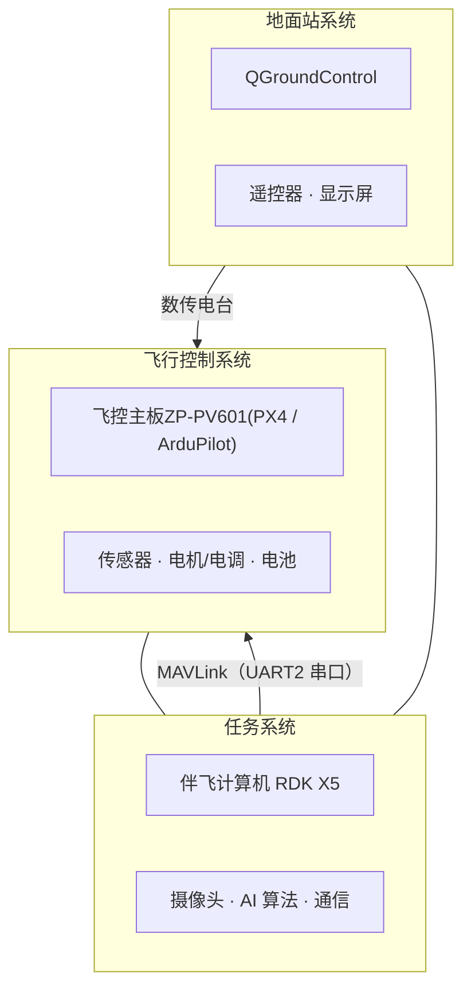
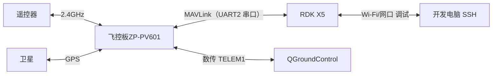
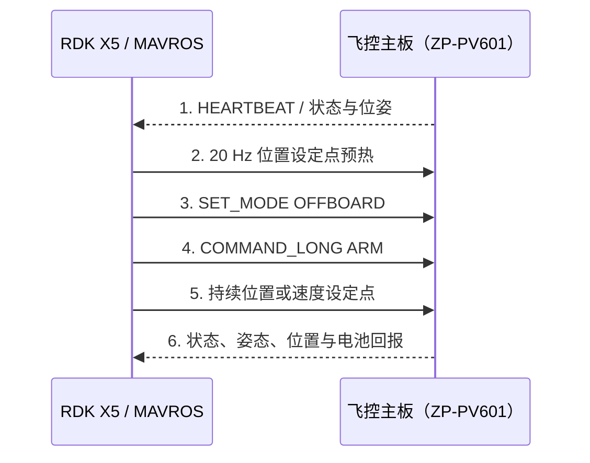
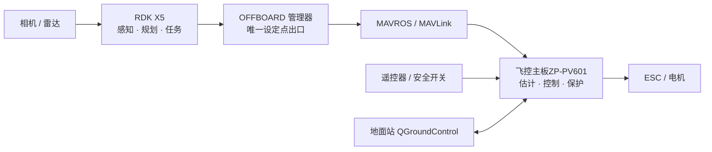
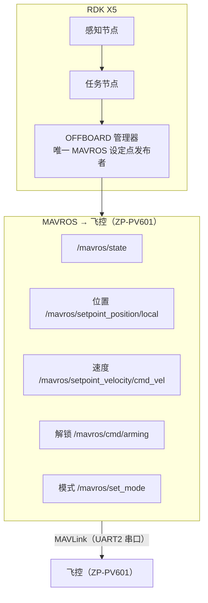

# RDK X5 + ZP-PV601 开发教程

本教程面向已经拥有ZP-PV601飞控或完整多旋翼平台的开发者。ZP-PV601负责姿态控制、状态估计、电机输出和故障保护；RDK X5负责机载感知、规划与任务控制。

**实物图**


本教程配套例程源码：https://github.com/ZettaTree01/RDKX5_ZP-PV601_DEMO.git。请将仓库内容部署到 RDK X5 的 `/app/zettatree_demo` 目录，如下图所示。


---

# 第一章：基础知识

## 1.1 系统组成及硬件

### 1.1.1 本例程系统组成



### 1.1.2 传感器系统

| 传感器 | 作用 | 数据 |
|--------|------|------|
| IMU (惯性测量单元) | 姿态测量 | 加速度、角速度 |
| 气压计 | 高度测量 | 气压、温度 |
| GPS | 位置定位 | 经纬度、速度 |
| 光流传感器 | 水平速度估计 | 光流数据 |
| 激光雷达 | 避障、建图 | 点云数据 |
| 摄像头 | 视觉感知 | 图像/视频 |
| 超声波 | 定高 | 距离 |
| 磁力计 | 航向测量 | 磁场强度 |

### 1.1.3 通信系统



MAVLink：轻量级无人机消息协议，支持串口/USB/数传等多种链路。

## 1.2 硬件基础

官方资料：
- [硬件简介](https://developer.d-robotics.cc/rdk_x_doc/Quick_start/hardware_introduction/rdk_x5)
- [40PIN 管脚定义](https://developer.d-robotics.cc/rdk_x_doc/Basic_Application/01_40pin_user_sample/40pin_define)

---

### 1.2.1 RDK X5 开发板概述

#### 1.2.1.1 核心规格

| 参数 | 规格 |
|------|------|
| 主芯片 | D-Robotics Sunrise® 5 |
| AI 算力 | 10 TOPS (INT8)，BPU 加速 |
| CPU | 8 核 ARM Cortex-A55 |
| 内存 | 常见 4GB / 8GB LPDDR4x |
| 存储 | eMMC + 板底 TF 卡槽 |
| 系统 | Ubuntu 22.04 + ROS2 Humble + TogetheROS |
| 推理 | `hbm_runtime`（BPU 量化模型 `.bin`） |

> 具体内存/eMMC 容量以板子丝印和 `free -h` / `lsblk` 为准。

#### 1.2.1.2 开发板接口实拍（官方）


*图：RDK X5 开发板接口编号（官方）。接口 10 是 HDMI，不是摄像头。*

#### 1.2.1.3 接口编号（RDK X5 开发板）

| 编号 | 接口 | 说明 |
|------|------|------|
| 1 | USB Type-C | **5V/5A** 电源，不要用电脑 USB 口供电 |
| 2 | 2-pin | **RTC 电池**（靠近 PWR 为 B+，另一脚 GND）。**禁止当跳线短接** |
| 3 | USB Type-C | 闪连 / QuickLink，USB Device（Fastboot、烧录） |
| 4 | Micro USB | **调试串口**，波特率 **115200 8N1** |
| 5 | 22-pin FPC ×2 | 双路 MIPI CSI 摄像头 |
| 6 | RJ45 | 千兆以太网，默认静态 IP `192.168.127.10`，支持 PoE |
| 7 | USB 3.0 Type-A ×4 | USB Host |
| 8 | CAN FD | CAN/CAN FD；终端电阻在接口 8 **后方 2pin**，不是接口 14 |
| 9 | 40-pin | GPIO / UART / I2C / SPI / I2S / PWM，默认 **3.3V** |
| 10 | HDMI | 最高 1080p |
| 11 | 3.5mm | 耳机音频 |
| 12 | 天线 | 板载 Wi-Fi 天线；金属壳需外接 IPEX |
| 13 | TF（底面） | Micro SD，**禁止热插拔** |
| 14 | 22-pin FPC | MIPI DSI LCD |

指示灯：绿色电源灯亮 = 供电正常；系统起来后橙色/ACT 灯闪烁。

---

### 1.2.2 40-pin GPIO 接口详解

物理脚位为 40PIN 排针（奇数脚一排、偶数脚一排）。

#### 1.2.2.1 官方引脚图


*图：官方 X5 40Pin Function Mapping。接线以本图和板丝印为准。*


*图：Pin1、Pin40 在板上的位置。杜邦线插反会烧口。*

#### 1.2.2.2 默认功能（出厂 / srpi-config）

| 功能 | BOARD 脚 | 设备节点 | 说明 |
|------|----------|----------|------|
| I2C5 | 3 (SDA), 5 (SCL) | 常见 `/dev/i2c-5` | 与 UART3 复用 |
| UART1 | 8 (TX), 10 (RX) | **`/dev/ttyS1`** | 默认使能（教程不使用此串口，X5↔飞控链路统一走 UART2，见 1.2.7） |
| SPI1 | 19, 21, 23, 24, 26 | `/dev/spidev1.x` | 双片选；与 JTAG 复用 |
| I2C0 | 27 (SDA), 28 (SCL) | 常见 `/dev/i2c-0` | 与 PWM2 复用 |
| PWM3 | 32, 33 | Hobot.GPIO PWM | **默认使能** |
| I2S1 | 7, 12, 35, 38, 40 | 音频 | 与 GPIO 复用 |
| 调试 UART | **不是 40PIN** | `/dev/ttyS0` | 走 Micro USB 接口 4 |

#### 1.2.2.3 电气限制（官方）

| 项目 | 数值 |
|------|------|
| 逻辑电平 | 开发板 40PIN **3.3V**，最大耐压 **3.46V** |
| 3.3V 输出 | 使用说明按 **800 mA** 控制；负载表写过 1 A，取保守值 |
| 5V 输出 | 使用说明 **500 mA** |
| 适配器 | 按上述负载至少 **25W（5V/5A）** |
| 接线 | **必须断电**再插杜邦线 |

---

### 1.2.3 调试接口详解

#### 1.2.3.1 调试串口（接口 4，Micro USB）

开发板调试口已经过板载 USB 转串口引出。

```
电脑 USB ──Micro USB──► RDK X5 接口 4（Debug）
参数：57600 8N1  无流控
板内对应 /dev/ttyS0（不要拿来做飞控透传测试）
```

Windows 首次需装 **CH340** 驱动。Linux 一般是 `/dev/ttyUSB0` 或 `/dev/ttyACM0`。

#### 1.2.3.2 调试串口连接步骤

```bash
# Windows 步骤：
1. 安装 CH340 驱动
2. 打开串口工具 (PuTTY / SecureCRT / MobaXterm)
3. 选择对应的 COM 口
4. 配置波特率 57600, 8N1
5. 连接后按回车键即可进入终端

# Linux 步骤：
# 安装 minicom 或 picocom
sudo apt install minicom picocom

# 连接调试串口
sudo picocom -b 57600 /dev/ttyUSB0

# 或使用 minicom
sudo minicom -b 57600 -D /dev/ttyUSB0
```

#### 1.2.3.3 SSH 远程登录

```bash
# 默认 IP 配置
# 以太网: 192.168.127.10 (静态)
# WiFi: DHCP (需先配置 WiFi)

# SSH 登录，以实际的IP地址登录
ssh sunrise@<板卡IP>

# 默认用户信息
# 用户名: sunrise / root
```

---

### 1.2.4 调试引脚与测试点

开发板日常调试用 **接口 4 Micro USB** 即可。

#### 1.2.4.1 调试口对照

| 用途 | 怎么接 | 参数 |
|------|--------|------|
| 系统串口登录 | 接口 4 Micro USB | 57600 8N1 |
| 飞控 MAVLink | X5 **40PIN UART2**（PIN20=GND、PIN22=RX、PIN15=TX，3.3V 共地）→ 飞控 TELEM | MAVROS `fcu_url=/dev/ttyS2:57600` |
| SSH | 网口或 Wi-Fi | 板子默认以太网 `192.168.127.10`；Wi-Fi 为 DHCP，以实际 IP 为准 |

内核阶段波特率在 `/boot/boot.cmd`，改完需：

```bash
mkimage -C none -A arm -T script -d boot.cmd boot.scr
```

#### 1.2.4.2 启动介质

开发板默认 eMMC 启动。系统烧录走闪连口（接口 3）或官方烧录工具，见 [系统烧录](https://developer.d-robotics.cc/rdk_x_doc/Quick_start/system-burn/overview)。

---

### 1.2.5 接口详细说明

#### 1.2.5.1 USB 接口

| 接口 | 类型 | 用途 |
|------|------|------|
| 闪连口（接口 3） | USB 2.0 Type-C | Fastboot / 烧录 |
| USB 3.0 ×4（接口 7） | USB 3.0 Type-A | U盘、USB 摄像头（U盘默认挂载 `/media/sda1`）；飞控 USB 口仅调试后备 |

Pixhawk USB 调试口默认输出 MAVLink（Linux 常见识别为 `/dev/ttyACM0`），可作调试后备。
**本教程 X5↔飞控主板（ZP-PV601） 链路不使用 USB**，统一走 40PIN UART2 针脚串口（见 1.2.7）。U盘默认挂载 `/media/sda1`。

#### 1.2.5.2 摄像头接口 (MIPI CSI)

两路摄像头都在接口 5（22pin ×2）。接口 9 = 40PIN，接口 10 = HDMI。

| 通道 | I2C 总线 | 复位 GPIO | 靠近 |
|------|----------|----------|------|
| mipi_host0 | 6 | 353 | 网口侧 |
| mipi_host2 | 4 | 351 | 远离网口 |

适配：IMX219 / OV5647 / IMX477。**严禁带电插拔**。排线金属面背对黑色卡扣插入。

```bash
# 检测 CAM2 上的 IMX219（351/353 是内核 GPIO 号，不是 40PIN BOARD 编号）
echo 351 > /sys/class/gpio/export
echo out > /sys/class/gpio/gpio351/direction
echo 0 > /sys/class/gpio/gpio351/value
sleep 0.1
echo 1 > /sys/class/gpio/gpio351/value
i2cdetect -y -r 4
# 地址 0x10 表示检测到 IMX219
```

#### 1.2.5.3 显示接口

| 接口 | 说明 |
|------|------|
| HDMI（接口 10） | 最高 1080p，输出 Ubuntu 桌面，**本例程显示屏接入采用HDMI的方式** |
| MIPI DSI（接口 14） | 22-pin FPC，兼容树莓派 LCD，需 DSI-Cable-12cm |

#### 1.2.5.4 网络接口

| 接口 | 说明 |
|------|------|
| 千兆以太网（接口 6） | 默认 IP `192.168.127.10`，支持 PoE |
| Wi-Fi（接口 12 附近） | 板载天线，可外接 IPEX，2.4/5GHz |

```bash
nmcli device wifi list              # 扫描
nmcli device wifi connect "SSID" password "PASSWORD"  # 连接
nmcli connection show               # 查看状态
```

#### 1.2.5.5 CAN FD 接口

CAN FD 接口（接口 8）：TCAN4550 SPI 转 CAN，最高 8Mbps。终端电阻 120Ω 在接口 8 后方 2pin（非接口 14）。高速 CAN 两端均需 120Ω。

接线：`CAN_H↔CAN_H`，`CAN_L↔CAN_L`，`GND↔GND`。

---

### 1.2.6 电源系统

#### 1.2.6.1 电源接口

| 接口 | 电压 | 电流 | 备注 |
|------|------|------|------|
| 主电源（接口 1 USB Type-C） | 5V | 5A (25W) | 绿色 LED = 正常，橙色 = 运行 |
| RTC 电池（接口 2） | 2V~3.3V | — | 禁止短接，充电 ≥3.3V |

⚠️ 必须使用 5V/5A 适配器，电脑 USB 口功率不足会导致关机/重启。

| 接口供电能力 | |
|------|------|
| CAN | 500mA @ 3.3V |
| DSI | 500mA @ 3.3V |
| 40PIN | 1A @ 3.3V / 1A @ 5V |
| USB 3.0 | 1A @ 5V |

---

### 1.2.7 例程1：机载计算机与飞控主板的串口交互（40PIN UART2 针脚串口）

> **本节说明**：通过 40PIN UART2（`/dev/ttyS2`）连接飞控(ZP-PV601) TELEM，使能串口后，用最小 MAVLink 脚本读取姿态，验证机载计算机与飞控之间的物理链路。
>
> **本节目标**：
>
> - 完成 PIN20=GND、PIN22=RX、PIN15=TX 交叉接线（3.3V TTL，断电操作）；
> - 使用 `fdtput` 使能设备树中的 UART2，重启后确认存在 `/dev/ttyS2`；
> - 运行 `attitude_via_usb.py`，以持续输出的 roll/pitch/yaw 判定链路正常。

配套例程：`/app/zettatree_demo/01_uart_serial`。

**本教程中，RDK X5 与 ZP-PV601 飞控之间统一使用 40PIN 针脚串口 UART2**：X5 侧设备节点为 `/dev/ttyS2`。与 X5 出厂默认使能的 UART1（PIN8/PIN10）不同，UART2 使用**PIN20=GND、PIN22=RX、PIN15=TX**，出厂在设备树中处于 `disabled`，需按下文「实际接线与 UART2 使能」使能一次。这条链路贯穿第二章起的全部飞控例程，台架与机载安装均适用。

```
RDK X5 40PIN（UART2）
      │   PIN20=GND │ PIN22=RX(收) │ PIN15=TX(发)
      │   杜邦线：TX↔RX 交叉，GND 共地，3.3V TTL
      ▼
飞控主板（ZP-PV601） TELEM（已开启 MAVLink）  ──►  X5 设备节点 /dev/ttyS2
```

#### 📌实际接线与 UART2 使能（首次使用必读）

本套例程实际接线只用三根线（**该组引脚与 X5 默认 UART1 的 PIN8/PIN10 不同**）：

| X5 40PIN 物理脚 | 功能 | 接到飞控 | 方向 |
|---|---|---|---|
| **PIN20** | GND | GND | 共地 |
| **PIN22** | UART2_RXD | 飞控主板 **TX** | ← 收 |
| **PIN15** | UART2_TXD | 飞控主板 **RX** | → 发 |

> Pixhawk 的 TELEM 口是 3.3V TTL，可直接对接；不要给 X5 40PIN 供 5V。
> 接线必须断电后操作；机载安装时杜邦线留余量并扎带固定、远离电机。

UART2 出厂在设备树里是 `disabled`，**<u>首次使用必须使能并重启</u>**：

```bash
# 1) 备份并修改启动设备树（x5_rdk_v2 对应 x5-rdk-v1p0.dtb，按实际板型选择）
sudo cp /boot/hobot/x5-rdk-v1p0.dtb /boot/hobot/x5-rdk-v1p0.dtb.bak-uart2
sudo fdtput -t s /boot/hobot/x5-rdk-v1p0.dtb \
    /soc/a55_apb0/serial@34080000 status okay

# 2) 重启生效
sudo reboot
```

重启后确认 `ttyS2` 已出现：

```bash
ls -l /dev/ttyS2     # crw-rw---- 1 root dialout 4, 66, ... /dev/ttyS2
```

恢复出厂（回到 UART2 禁用，**<u>此步骤非必需执行的步骤</u>**）：

```bash
sudo cp /boot/hobot/x5-rdk-v1p0.dtb.bak-uart2 /boot/hobot/x5-rdk-v1p0.dtb && sudo reboot
```

> 设备树按板型选择：`x5_rdk_v1`→`x5-rdk.dtb`、`x5_rdk_v2`→`x5-rdk-v1p0.dtb`、MD 系列用 `x5-md-v0p2.dtb`/`x5-md-v1p2.dtb`；
>
> 不确定时对比`cat /sys/firmware/devicetree/base/model` 与各 dtb 的 `model` 属性。

飞控侧要求：所接 TELEM 口必须**已开启 MAVLink 实例**，波特率与 `fcu_url`一致（本教程统一 **57600**）。飞控主板（ZP-PV601） 默认在 TELEM2 输出 MAVLink；若接的是 TELEM1，先在 QGC 把 `MAV_0_CONFIG` 指向实际 TELEM 端口（详见第二章）。

使能并重启后，先确认设备与权限：

```bash
ls -l /dev/ttyS2
sudo usermod -aG dialout "$USER"   # 重新登录后生效
```

#### 1.2.7.1 验证链路：读取飞控姿态

`attitude_via_usb.py` 直接打开 `/dev/ttyS2`（57600），用 MAVLink v2 解析字节流；等到 HEARTBEAT 后用 `MAV_CMD_SET_MESSAGE_INTERVAL(511)` 请求飞控按指定频率下发 `ATTITUDE(30)`，能持续打印 roll/pitch/yaw，就说明 **机载计算机 ↔ 飞控主板之间的串口链路是通的**。它只订阅、不下发任何控制指令，不会解锁或切模式，适合作为例程1的验收，也可作为后续所有例程的链路自检：

**启动步骤**：先按上文使能 UART2 并重启、接好三根线（PIN20=GND、PIN22=RX、PIN15=TX），然后在**任意终端**直接运行：

```bash
# 40PIN UART2 直连飞控：20 Hz、跑 10 秒后退出
python3 /app/zettatree_demo/01_uart_serial/attitude_via_usb.py --rate 20 --duration 10
```

预期输出：先打印 `心跳 OK: sysid=1 compid=1 autopilot=PX4 type=Quadrotor`，随后持续刷新 `roll pitch yaw | p q r °/s`；退出时汇总 `收到 ATTITUDE N 帧`。若一直只提示 `仍未收到心跳`，按顺序检查：飞控是否上电、UART2 是否已使能（`ls -l /dev/ttyS2`）、TX/RX 是否交叉接反、飞控 TELEM 是否已开启 MAVLink、当前用户是否在 `dialout` 组。

详细代码实现见 [`01_uart_serial/attitude_via_usb.py`](https://github.com/ZettaTree01/RDKX5_PX4_DEMO/blob/main/01_uart_serial/attitude_via_usb.py)。

#### 1.2.7.2 进阶：拆桨电机测试（可选）

`motor_test_via_usb.py` 走同一条 40PIN UART2 针脚串口，经 MAVLink shell 调用 PX4 自带的 `actuator_test`，让电机实际转动，进一步验证 X5 不仅能“读”飞控，还能让飞控“动”。

```bash
# 只探测 actuator_test 是否可用（不转电机）
python3 /app/zettatree_demo/01_uart_serial/motor_test_via_usb.py --probe

# 拆桨 + 固定飞机后，怠速斜坡加速约 6 秒（最高 600 r/min）
python3 /app/zettatree_demo/01_uart_serial/motor_test_via_usb.py \
    --duration 6 --i-am-sure
```

执行结果，电机会从怠速慢慢加速，最高约 600 r/min，能看出转速变化：

> [!WARNING]
>
> 安全约束：必须**拆桨**、飞机固定牢靠；

命令带 `-t` 超时，到时飞控自动停转；Ctrl+C 会立即发送停止指令。
详细代码实现见 [`01_uart_serial/motor_test_via_usb.py`](https://github.com/ZettaTree01/RDKX5_PX4_DEMO/blob/main/01_uart_serial/motor_test_via_usb.py)。输出示例见板端 `/app/zettatree_demo/01_uart_serial/README.md`。

---

### 1.2.8 无人机开发常用接口配置

#### 1.2.8.1 飞控通信接口

| 方式 | 说明 |
|------|------|
| 40PIN UART2 | Pin15 TX→飞控 RX、Pin22 RX←飞控 TX、Pin20 GND 共地；`/dev/ttyS2:57600`，飞控侧 TELEM 需开启 MAVLink（见 1.2.7） |
| USB（调试后备） | X5 USB3.0（接口 7）→ 飞控 USB 口；`/dev/ttyACM0`，飞控主板（ZP-PV601）默认输出 MAVLink |
| CAN（可选） | 接口 8：CAN_H/CAN_L/GND，PX4 UAVCAN |

> [!IMPORTANT]
>
> Pixhawk 的 TELEM 口为 3.3V TTL；GPS 接飞控 GPS 口，不要占用 X5 的 UART1，也不要占用飞控上已用作 X5↔飞控链路的 TELEM 口。

#### 1.2.8.2 GPS 接在飞控上，由飞控做定位

GPS / 磁力计接到 **Pixhawk GPS 口**，由 飞控 做定位。X5 通过 MAVROS 订阅 `/mavros/global_position/*` 即可。

其他定位方案（光流、VIO、动捕）也必须先接入`PX4 EKF`，确认本地位置有效后再使用位置 `OFFBOARD`。

#### 1.2.8.3 摄像头连接 (无人机视觉)

| 类型 | 接口 | 说明 |
|------|------|------|
| MIPI CSI（推荐，彩色） | CAM1 / CAM2（接口 5） | 高带宽低延迟；**严禁带电插拔** |
| **MIPI 双目深度（例程8/9/10 ）** | **MIPI CSI + 双目扩展板** | **GS130W（SC132GS）** + `hobot_stereonet`；启动见 **4.3** `bash .../08_depth_camera/run.sh` |
| **USB 彩色摄像头（例程 3–7）** | USB 3.0 Type-A（接口 7） | 普通 USB，常见 `/dev/video0`；**不是** GS130W |
| USB 深度相机（备选） | USB 3.0 Type-A（接口 7） | Orbbec / RealSense；例程侧 `source:=orbbec` / `realsense` |

推荐彩色型号：IMX219（8MP 通用）、OV5647（5MP 性价比）、IMX477（12MP 高清）。  
推荐深度方案：**RDK 官方 GS130W MIPI 双目 + Stereonet（BPU）**；备选 Orbbec Gemini2 / RealSense D435 等（以板端驱动支持为准）。

无人机视觉应用：目标检测与跟踪、降落标志识别、障碍物检测、深度点云建模与导航。

---

### 1.2.9 硬件注意事项与常见问题

#### 1.2.9.1 电源注意事项

✅ 正确做法：5V/5A 适配器；检查绿+橙指示灯；带过流保护；无人机用独立电源模块。

❌ 错误做法：电脑 USB 口供电；劣质适配器；带电插拔；电源线过长。

⚠️ 功率不足症状：异常关机、反复重启、AI 推理不稳定、USB 设备不识别。

#### 1.2.9.2 GPIO 安全注意事项

⚠️ 绝对禁止：施加超过 3.46V 电压；输出超过 8mA/pin；带电插拔杜邦线；直接连接电机/舵机等大功率设备。

✅ 正确做法：检查电压匹配；加限流电阻（220Ω~1KΩ）；使用驱动芯片（ULN2003、L298N）；加光耦隔离；连接前确认引脚定义。

**无人机上 X5 只做伴飞计算机：**
- 禁止用 Pin32/33 PWM 直接驱电调（电机必须走飞控）
- 与飞控：40PIN UART2 针脚串口（PIN20=GND / PIN22=RX / PIN15=TX，`/dev/ttyS2`）
- 视觉：MIPI CSI（接口 5）或 USB 摄像头
- GPIO 只做 LED/按键等弱电信号

#### 1.2.9.3 散热与环境

| 项目 | 范围 |
|------|------|
| 正常工作温度 | 0°C ~ 45°C |
| AI 推理建议 | < 40°C |
| 存储温度 | -20°C ~ 60°C |

散热：散热片 + 飞行气流；避免阳光直射。开发板接口 7 是 USB3，不是风扇口。

```bash
cat /sys/class/thermal/thermal_zone*/temp        # 查看 CPU 温度
watch -n 1 cat /sys/class/thermal/thermal_zone0/temp  # 监控变化
```

---

### 1.2.10 RDK X5 规格汇总

#### 1.2.10.1 完整规格表

| 分类 | 参数 | 规格 |
|------|------|------|
| **处理器** | 主芯片 | D-Robotics Sunrise® 5 |
| | CPU | 8 核 ARM Cortex-A55 |
| | BPU | 10 TOPS (INT8) |
| **内存** | 类型 | LPDDR4x |
| | 容量 | 4GB / 8GB |
| | 带宽 | 51.2 GB/s |
| **存储** | eMMC | 16GB / 32GB |
| | TF 卡 | 支持 Micro SD (最大 512GB) |
| | QSPI NAND | 可选 |
| **视频** | 视频解码 | H.265/H.264, 最高 4K@60fps |
| | 视频编码 | H.265/H.264, 最高 1080p@60fps |
| | 摄像头接口 | 2x 4-lane MIPI CSI |
| | 显示接口 | HDMI (1080p) + MIPI DSI |
| **音频** | 音频接口 | 3.5mm 耳机孔 |
| | 音频芯片 | ES8326B (I2S to DAC/ADC) |
| **网络** | 以太网 | 千兆以太网 (RJ45) + PoE |
| | Wi-Fi | 802.11ac (2.4GHz/5GHz) |
| | 蓝牙 | Bluetooth 5.0 |
| **USB** | USB 2.0 | 1x Type-C (Device/Host) |
| | USB 3.0 | 4x Type-A (Host) |
| **GPIO** | 40-pin 接口 | GPIO, I2C, SPI, I2S, PWM |
| | 电压 | 开发板 40PIN 按 **3.3V**（Module 载板才有 1.8/3.3 切换） |
| **其他** | CAN FD | 1x (TCAN4550) |
| | 调试串口 | Micro USB (UART0) |
| | RTC | 支持电池备份 |
| | 风扇 | 开发板接口 7 是 USB3，不要当风扇口 |
| **电源** | 输入电压 | 5V DC |
| | 输入电流 | 5A (25W) |
| | 接口 | USB Type-C |
| **物理** | 尺寸 | 以官方机械图纸为准 |
| | 工作温度 | 0°C ~ 45°C |

---

> 继续阅读：[1.3 整机组装参考](#13-整机组装参考)
> 
> **返回目录**: [RDK X5 无人机开发实战教程 - 目录](#目录)

## 1.3 整机组装参考

### 1.3.1 硬件清单

#### 核心硬件

| 硬件 | 型号推荐 | 数量 | 说明 |
|------|---------|------|------|
| 飞控板 | Pixhawk 6C/6X | 1 | 飞行控制核心 |
| RDK X5 开发板 | D-Robotics RDK X5 | 1 | AI 计算核心 |
| 机架 | F450（四旋翼） | 1 | F550 六旋翼需 6 电机/6 电调，不要混用 |
| 电机 | 2212 920KV | 4 | 无刷电机（四旋翼） |
| 电调 (ESC) | 30A | 4 | 电机调速器 |
| 螺旋桨 | 9寸/10寸 | 2对 | 正桨 2 + 反桨 2（四旋翼） |
| 电池 | 3S/4S LiPo | 1 | 11.1V/14.8V |
| 充电器 | B6/IMAX | 1 | 平衡充电器 |
| 遥控器 | FlySky/天地飞 | 1 | 含接收机 |

#### 传感器硬件

| 硬件 | 型号推荐 | 说明 |
|------|---------|------|
| GPS 模块 | M8N/M10 | GPS + 磁力计 |
| 光流传感器 | PMW3901 | 水平速度估计 |
| 激光雷达 | RPLIDAR A1/A2 | 避障、建图 |
| 摄像头 | USB/MIPI 摄像头 | 视觉感知 |
| 气压计 | 飞控内置 | 高度测量 |

#### 通信硬件

| 硬件 | 型号推荐 | 说明 |
|------|---------|------|
| 数传模块 | 433MHz/915MHz | 飞控-地面站通信 |
| WiFi 模块 | ESP8266/ESP32 | 高带宽通信 |
| 图传 | 5.8GHz | 视频传输 |
| USB 转串口 | CH340/CP2102 | 调试用 |

### 1.3.2 硬件连接

#### 飞控板连接

Pixhawk 6C 主要接口：MAIN OUT（电机 1-4）、AUX OUT（舵机）、RC IN（接收机）、SERIAL（GPS/数传/调试）、I2C、SPI、USB（调试）、POWER（电源）。

#### RDK X5 与飞控连接

X5 与飞控主板ZP-PV601之间**统一使用 40PIN UART2 针脚串口**连接（台架与机载安装方式相同），
首次使用需先使能 UART2（见 1.2.7「实际接线与 UART2 使能」）：

| 方式 | 接线 | 备注 |
|------|------|------|
| 40PIN UART2 | PIN20=GND、PIN22=UART2_RXD→飞控 TX、PIN15=UART2_TXD→飞控 RX | `/dev/ttyS2:57600`，飞控 TELEM 需开启 MAVLink |
| 数传 | 飞控 TELEM1 ↔ 数传电台 ↔ 地面站 QGC | 与 X5↔飞控链路互不影响 |
| USB（调试后备） | X5 USB3.0（接口 7）→ 飞控 USB 口 | `/dev/ttyACM0`，飞控默认输出 MAVLink |

> 组装实机时杜邦线留出减震余量并扎带固定、远离电机。逻辑电平 3.3V TTL，
> 接线必须 TX↔RX 交叉、GND 共地；务必断电后再插拔杜邦线。

电机对角同向；桨叶方向必须匹配。以 QGC 电机测试为准。

### 1.3.3 组装步骤

#### 步骤1：安装机架

```bash
# 1. 组装机架臂
# 2. 安装电机座
# 3. 固定电机
# 4. 安装起落架
```

#### 步骤2：安装飞控

```bash
# 1. 将飞控板固定在机架中心
# 2. 使用减震垫减少振动
# 3. 注意飞控箭头指向机头方向
# 4. 连接电机电调
```

#### 步骤3：安装传感器

```bash
# 1. 安装 GPS 模块（远离电机和电调）
# 2. 安装光流传感器（底部朝下）
# 3. 安装摄像头（机头方向）
# 4. 连接所有传感器线缆
```

#### 步骤4：安装 RDK X5

```bash
# 1. 将 RDK X5 固定在机架上
# 2. 机载连接：X5 40PIN（PIN20/22/15）杜邦线接飞控 TELEM（TX↔RX 交叉、GND 共地），并扎带固定线缆
# 3. 连接摄像头
# 4. 连接电源模块
```

#### 步骤5：连接电源

```bash
# 1. 连接电池
# 2. 检查电源模块
# 3. 测试电机转向
# 4. 检查所有连接
```

## 1.4 环境搭建

### 1.4.1 软件环境准备

#### 基础软件

```bash
# 1. SSH 连接到 RDK X5
ssh sunrise@<板卡IP>

# 2. 设置 ROS2 / TogetheROS。tros 的 setup 已叠加 Humble，一般只 source 这一行
echo "source /opt/tros/humble/setup.bash" >> ~/.bashrc
source ~/.bashrc
```

#### 安装飞控相关软件

```bash
# 1) 消息包（arm64 apt 通常有）
sudo apt update
sudo apt install -y ros-humble-mavros-msgs ros-humble-mavlink

# 2) MAVROS 节点：镜像/apt 已有则直接用；jammy/arm64 常无 deb 时源码编译
ros2 pkg prefix mavros || \
  bash /app/zettatree_demo/00_env_check/setup_mavros.sh
# 源码产物：/app/zettatree_demo/mavros_ws/install
# （一键体检 bash .../00_env_check/run.sh --yes 会自动处理）

# 串口访问权限；执行后重新登录
sudo usermod -aG dialout "$USER"

# GeographicLib 脚本位置以实际安装前缀为准
source /opt/tros/humble/setup.bash
source /app/zettatree_demo/mavros_ws/install/setup.bash 2>/dev/null || true
MAVROS_PREFIX="$(ros2 pkg prefix mavros)"
sudo "$MAVROS_PREFIX/lib/mavros/install_geographiclib_datasets.sh" || \
sudo "$MAVROS_PREFIX/share/mavros/scripts/install_geographiclib_datasets.sh"
```

### 1.4.2 部署配套例程

配套例程是可直接运行的 ROS2 Python 脚本，不需要先创建空的 colcon 工作空间。
在开发电脑执行：

```bash
scp -r 02 sunrise@<X5_IP>:/app/zettatree_demo
```

然后在 X5 上执行：

```bash
cd /app/zettatree_demo
python3 00_env_check/env_check.py
python3 00_env_check/verify_ros_imports.py
```

### 1.4.3 验证环境

```bash
# X5↔飞控统一 40PIN UART2（未使能时先按 1.2.7 使能并重启）
ls -l /dev/ttyS2

# 启动 MAVROS
ros2 launch mavros px4.launch fcu_url:=/dev/ttyS2:57600

# 新终端确认 FCU 心跳和本地位置
source /opt/tros/humble/setup.bash
ros2 topic echo --once /mavros/state
ros2 topic echo --once /mavros/local_position/pose
```

`/mavros/state` 必须显示 `connected: true`。位置控制还必须收到
`/mavros/local_position/pose`；没有 GPS、光流、VIO 或动捕定位时，不进入位置 OFFBOARD。

### 1.4.4 配套例程目录

```
/app/zettatree_demo/
├── 00_env_check
├── 01_uart_serial               # 例程1：40PIN UART2 针脚串口验证机载↔飞控
├── 02_bench_pose_sim            # 例程2：台架位姿模拟器（室内拆桨验证）
├── 03_camera_node               # 例程3：USB 摄像头发布（弹窗 / 快照查看画面）
├── 04_object_detection          # 例程4：目标检测节点
├── 05_obstacle_avoidance        # 例程5：摄像头识别避障（单目估距）
├── 06_autonomous_cruise         # 例程6：自主巡航拍照
├── 07_target_tracking           # 例程7：停机坪 H 标对准降落（BPU）
├── 08_depth_camera              # 例程8：GS130W Stereonet（统一 run.sh）
├── 09_depth_nav                 # 例程9：完整 C++ EGO-Planner + Stereonet
├── 10_target_follow             # 例程10：目标跟随（行人 + EGO 动态 goal）
├── 11_formation_flight          # 例程11：编队
└── _common/                    # 含 indoor.py：室内调试把电机/速度压到 1/20
```

其中 `00_env_check` 是环境自检例程：不接飞控、不接线也能运行，`env_check.py` 检查 Python 依赖、40PIN UART2 串口（`/dev/ttyS2`）、ROS2/MAVROS 与 YOLO 模型是否就绪，`verify_ros_imports.py` 逐项导入感知相关 Python 模块；**跑任何飞行例程前先过这一关**。

每个目录的 `README.md` 给出独立运行命令。后续若要做成正式 ROS2 package，再创建 colcon 工作空间，不要把空工作空间当作本教程例程的运行前置。

## 1.5 飞控与MAVLink

### 1.5.1  MAVLink 与飞控之间的通信流程



### 1.5.2 QGroundControl 地面站

#### 安装与启动

在 **地面站 PC** 安装 QGroundControl（Windows/Linux x86_64 安装包，下载地址：https://github.com/mavlink/qgroundcontrol/releases），用 USB 或数传连接飞控。也可直接使用ZettaTree网页版地面站，地址：[ZettaTree地面站](https://www.zettatree.com/ground/)

#### 基本操作

| 阶段 | 功能 |
|------|------|
| 飞行前检查 | 传感器校准、遥控器校准、电池设置、安全设置 |
| 飞行中监控 | 姿态显示、GPS 状态、电池电量、飞行模式 |
| 任务规划 | 航点设置、测绘航线、任务执行 |

### 1.5.3 飞控参数配置

#### 关键参数

先在 QGroundControl 完成机架选择、传感器校准、遥控器校准、电池设置、电机顺序与转向测试。完成这些飞控基础配置后，再连接 X5。

X5 与飞控主板（ZP-PV601）之间**使用 40PIN UART2 针脚串口**（`/dev/ttyS2`，接线与使能见 1.2.7）。飞控 TELEM 串口要输出 MAVLink，需先在 QGroundControl 配置并重启；MAVROS 的 `fcu_url` 填 `/dev/ttyS2:57600`，与 TELEM 波特率（57600）完全一致。

> 在 QGroundControl 参数页设置并重启 PX4（不同飞控用实际 TELEM 口编号）：
>
> ```text
> MAV_0_CONFIG      = TELEM 2   # 实际接 X5 的 TELEM 口（若接 TELEM1 就选 TELEM 1）
> MAV_0_MODE        = Onboard
> SER_TEL2_BAUD     = 57600
> ```
>
> 原则是 `MAV_X_CONFIG` 选择实际串口、`MAV_X_MODE=Onboard`，且`SER_TELx_BAUD` 与 X5 的 `fcu_url` 完全一致。
> 若使用 X5 USB3.0→飞控 USB 调试口作后备，飞控主板（ZP-PV601）默认输出 MAVLink，无需这些参数。

在参数页确认 OFFBOARD 失联保护：

```text
COM_OF_LOSS_T     # 设定点中断多久判定 OFFBOARD 失联
COM_OBL_RC_ACT    # OFFBOARD 失联后的动作
```

按有无遥控器分别测试失联动作。实飞必须保留人工接管方式，不要假设通信中断后飞行器会继续悬停。

#### ROS2 参数配置

MAVROS 用 launch 参数，不是下面这种嵌套 YAML：

```bash
# X5↔飞控统一 40PIN UART2。Humble 上是 px4.launch（XML），不是 px4.launch.py
ros2 launch mavros px4.launch fcu_url:=/dev/ttyS2:57600
```

机架、电机配置

完成本章基础配置后，从第二章开始按顺序执行实战。

---

# 第二章：飞控主板ZP-PV601与 X5 最小联调与 OFFBOARD 控制

完成本章后应达到三个结果：X5 能稳定启动 MAVROS、`/mavros/state` 显示`connected: true`、飞控能持续输出有效本地位姿。本章 2.7 介绍的 OFFBOARD 管理器是全部飞行例程的公共底座；本章自身不执行解锁。

## 2.1 系统链路



飞行任务不得并行向多个 MAVROS setpoint 话题发布控制指令。本教程例程统一由 `_common/offboard_manager.py`（见 2.7）接收位置与速度目标后再转发至飞控。

## 2.2 开始前确认

- 飞控固件（PX4）、机架类型、传感器方向和电机顺序已经在 QGroundControl 中配置。
- 遥控器或其他人工接管方式已经验证。
- X5 使用稳定的 5V/5A 电源，飞控使用独立电源模块。
- GPS、光流、VIO 或动捕中的一种已经接入 PX4 EKF。
- 首次 OFFBOARD 测试拆除全部桨叶。

## 2.3 X5 与飞控连接

台架与机载安装均使用 **40PIN UART2**（设备节点 `/dev/ttyS2:57600`）连接飞控 TELEM。
接线、使能与电平要求见 **1.2.7**，此处不重复。

- 飞控侧：所接 TELEM 须开启 MAVLink，波特率与 `fcu_url` 一致（57600）。
- USB 调试口仅作后备；本教程以 UART2 为准。

## 2.4 确认飞控主板（ZP-PV601） TELEM 串口输出 MAVLink

所接 TELEM 口必须在 QGroundControl 里确认输出 MAVLink：机架、传感器、遥控器与电机顺序已校准，并把 `MAV_0_CONFIG` 指向实际 TELEM 口、`MAV_0_MODE=Onboard`、`SER_TELx_BAUD=57600`，重启飞控后能在 `/mavros/state` 看到 `connected: true`。

> 若使用 X5 USB3.0→飞控 USB 调试口作后备，飞控主板（ZP-PV601）默认输出 MAVLink，无需上述参数；
> 但本教程飞控链路统一为 40PIN UART2 针脚串口，请以 TELEM 配置为准。

无论哪种链路，都请配置并记录 OFFBOARD 失联保护：

```text
COM_OF_LOSS_T     # OFFBOARD 设定点超时
COM_OBL_RC_ACT    # OFFBOARD 失联动作
```

失联动作必须分别在有遥控器和无遥控器条件下进行拆桨验证。

## 2.5 准备 X5 环境

```bash
ssh sunrise@<X5_IP>
source /opt/tros/humble/setup.bash

ros2 pkg prefix mavros || \
  bash /app/zettatree_demo/00_env_check/setup_mavros.sh
sudo usermod -aG dialout "$USER"
```

重新登录后，从开发电脑部署例程：

```bash
scp -r 02 sunrise@<X5_IP>:/app/zettatree_demo
```

在 X5 上执行：

```bash
python3 /app/zettatree_demo/00_env_check/env_check.py
python3 /app/zettatree_demo/00_env_check/verify_ros_imports.py
```

若自检只报告 MAVROS 运行库缺失，更新匹配的 ROS2 依赖后重跑：

```bash
sudo apt install --only-upgrade ros-humble-diagnostic-updater
```

## 2.6 启动并验证 MAVROS

启动 MAVROS（链路为 1.2.7 所述 UART2）：

```bash
source /opt/tros/humble/setup.bash
ros2 launch mavros px4.launch fcu_url:=/dev/ttyS2:57600
```

新终端执行：

```bash
ros2 topic echo --once /mavros/state
ros2 topic echo --once /mavros/local_position/pose
ros2 topic hz /mavros/local_position/pose
```

进入下一章前确认：

- `connected: true`
- 本地位姿持续更新且静止时无明显跳变
- QGroundControl 没有 Preflight Fail
- 遥控器、低电量和 OFFBOARD 失联动作已经配置

### 2.6.1 例程通用启动约定（无基础用户先读）

配套例程都在 RDK X5 的 `/app/zettatree_demo/` 下，每个目录一个例程、一份 `README.md`。
各例程启动方式遵循同一模板，按需修改参数即可。通用约定集中在本节；后续章节仅给出差异项。

> **室内调试限速**：怠速慢转、按任务加速、最高 **600 r/min**（约 2 秒从静止到最高速）。
> 速度/高度为实飞 1/20。把 `INDOOR_SPEED_SCALE` 改为 `1.0` 即恢复实飞。
> 机体速度为 FLU（前 / 左 / 上）。台架上前飞对应机头下俯、后电机加快；左飞对应左翼下沉、右电机加快。

关键常量定义见 [`_common/indoor.py`](https://github.com/ZettaTree01/RDKX5_PX4_DEMO/blob/main/_common/indoor.py)：`INDOOR_SPEED_SCALE = 0.05`（速度/高度为实飞 1/20）、最高转速 `MAX_MOTOR_RPM = 600`。

**① 每个 `run.sh` 会自动加载环境，不必手动 `source`。**
脚本内部会执行 `source /app/zettatree_demo/_common/env.sh`（优先 `/opt/tros/humble/setup.bash`，其次 `/opt/ros/humble/setup.bash`）。所以用 `bash xxx/run.sh` 启动时**不用先 source**；
只有当你自己直接敲 `ros2 ...` 命令（例如 `ros2 topic echo`）时，才需要先`source /opt/tros/humble/setup.bash`。

**② 每个飞行例程都是「一条命令拉起全部」。**
`run.sh` 内部执行 `ros2 launch <例程>.launch.py`，该 launch **自己**会拉起 MAVROS、OFFBOARD 管理器和本任务节点（相机类例程还会拉起相机节点）。所以：

- 跑一个例程 = **一个终端、一条命令**，例如
  `bash /app/zettatree_demo/06_autonomous_cruise/run.sh arm:=true`（室内默认高度 0.1 m）；
- **不要再单独另起 MAVROS 或管理器**，否则会抢同一个串口和设定点流；
- **同一时刻只跑一个飞行例程**（一个串口只能被一路 MAVROS 占用）。

| 例程 | 命令 | 说明 |
|---|---|---|
| 01 | `python3 /app/zettatree_demo/01_uart_serial/attitude_via_usb.py` | 直接读串口，不依赖 MAVROS |
| 02 | `bash /app/zettatree_demo/02_bench_pose_sim/run.sh` | 台架位姿回灌（**拆桨专用**，见 2.8） |
| 03~04、08 | `bash /app/zettatree_demo/<例程>/run.sh` | 相机 / 检测 / 深度点云，不接飞控 |
| 05~07、09~10 | `bash /app/zettatree_demo/<例程>/run.sh [参数]` | 飞行例程自带 MAVROS + 管理器 + 任务 |

> - **只看链路、不飞**：命令里不传 `arm:=true`，管理器处于监视模式（20 Hz 发「保持当前位置」，不解锁）。
> - **相机 / 检测例程（03、04）**不接飞控：03 只有相机，04 是相机 + 检测节点。
> - **例程 2 台架模拟**只用于拆桨台架：把设定点回灌成位姿后，飞控才能在室内解锁（见 2.8）。

**进阶：只调试单个任务节点**（MAVROS 与管理器已由别的终端提供时）：
`source /app/zettatree_demo/_common/env.sh && python3 <例程目录>/<节点>.py`。

**③ 跑任何例程前，先过环境自检（不接飞控、不接线也能跑）。**

```bash
python3 /app/zettatree_demo/00_env_check/env_check.py
python3 /app/zettatree_demo/00_env_check/verify_ros_imports.py
```

**④ 怎么判断「真的跑起来了」。**

- 链路通了：`ros2 topic echo --once /mavros/state` 出现 `connected: true`；
- 已起飞（飞行例程传了 `arm:=true`）：`ros2 topic echo --once /drone/status/airborne` 为 `true`。

**⑤ 结束与残留清理。**

每个前台终端按 `Ctrl+C` 结束；若结束后摄像头/节点仍被占用：

```bash
ps -eo pid,cmd | grep -E 'camera_node.py|offboard_manager.py|mavros_node' | grep -v grep
kill <上面列出的 PID>
```

关停时 MAVROS 报 `Resource deadlock avoided` 属**已知现象**，不是运行期故障。

> **室内无 GPS 且需解锁**：EKF 无位置估计时普通解锁会被拒绝。拆桨台架可使用例程 2（见 2.8）回灌外部视觉位姿；管理器在 `bench:=true` 下使用强制解锁（MAV_CMD 400，param2=21196）。**必须拆桨。**
>
> **安全收尾**：飞行例程 `run.sh` 在 `Ctrl+C` / 退出时经 UART 强制上锁；若电机仍转，执行 `python3 /app/zettatree_demo/_common/emergency_disarm.py`。

## 2.7 OFFBOARD 管理器：飞行例程的公共底座



各飞行例程（避障、巡航、跟踪、编队、台架模拟）共用 `_common/offboard_manager.py`，
以约 20 Hz 维持唯一的 MAVROS 设定点流。流程为：预热 → 切 OFFBOARD → 解锁 → 起飞 → 转发任务目标；
任务设定点超时则悬停。任务节点仅向管理器提交目标，不得并行向 MAVROS setpoint 发布。
管理器无独立入口，由各飞行例程的 launch 自动拉起。

> **本节目标**：
> - 理解单一设定点出口的必要性，避免多节点抢控；
> - 掌握进入 OFFBOARD 的条件（定位有效、设定点持续、无 Preflight Fail）；
> - 区分监视模式（默认，不解锁）与执行模式（`arm:=true`）；
> - 理解任务设定点超时 0.5 s 后锁定当前位置悬停的安全逻辑。

### 管理器接口

任务节点只向管理器发布以下话题：

| 话题 | 方向 | 含义 |
|------|------|------|
| `/drone/setpoint_position/local` | 任务→管理器 | 本地 ENU 位置目标 |
| `/drone/setpoint_velocity/body` | 任务→管理器 | 机体 FLU 速度目标 |
| `/drone/control/land` | 任务→管理器 | `Bool true` 请求 `AUTO.LAND` |
| `/drone/status/airborne` | 管理器→任务 | 达到 95% 起飞高度后为 `true` |

机体速度约定为 **FLU**（前 / 左 / 上）。管理器按当前偏航转到本地 ENU 后再发给 MAVROS。台架模式下同时发布姿态设定点，让混控按俯仰、横滚拉开电机转速（必须拆桨听辨）。MAVROS 会把 ENU 四元数转到 PX4 的 NED，欧拉俯仰符号会翻转，因此代码里用**正 pitch 对应前飞**（转换后为机头下俯），不要按 ROS 欧拉角字面符号理解：

| 机体速度 | 姿态 | X 四旋翼电机 |
|----------|------|----------------|
| `+vx` 前飞 | 机头下俯 | 后电机加快、前电机减慢 |
| `+vy` 左飞 | 左翼下沉 | 右电机加快、左电机减慢 |
| `+vz` 上升 | 提高总距 | 四电机一起加快 |

室内最高 **600 r/min**。悬停油门低于上限，混控才有余量做差速。

### MAVROS 话题与服务

管理器经 MAVROS 与飞控通信。常用话题：

| 话题 | 方向 | 说明 |
|------|------|------|
| /mavros/state | 订阅 | 飞行状态 |
| /mavros/local_position/pose | 订阅 | 本地位置 |
| /mavros/global_position/global | 订阅 | GPS 位置 |
| /mavros/setpoint_position/local | 发布 | 位置控制 |
| /mavros/setpoint_velocity/cmd_vel | 发布 | 速度控制（机体 FLU 已转到本地 ENU） |
| /mavros/attitude | **订阅** | 飞控姿态（只读） |
| /mavros/setpoint_raw/attitude | 发布 | 台架姿态+油门，供混控拉开俯仰/横滚差速 |

常用服务：

| 服务 | 说明 |
|------|------|
| /mavros/cmd/arming | 解锁/上锁 |
| /mavros/set_mode | 设置飞行模式 |

进入 OFFBOARD 前，必须确认：

1. `/mavros/state` 为 `connected: true`。
2. `/mavros/local_position/pose` 持续有效。
3. 飞控/QGC 没有 Preflight Fail。
4. 管理器已连续发送设定点至少 1 秒；本例使用 20 Hz、2 秒。
5. 首次测试已拆除桨叶并验证遥控器接管和 OFFBOARD-loss。

### 启动方式与两种模式

管理器由各飞行例程的 `run.sh` 自动拉起（MAVROS + 管理器 + 任务节点一条命令起齐）。
不要单独运行管理器，也不要在例程运行时另起一路 MAVROS（会抢同一个串口和设定点流）：

```bash
# 监视模式（默认）：只 20 Hz 发「保持当前位置」，不解锁，飞机不动
bash /app/zettatree_demo/05_obstacle_avoidance/run.sh

# 执行模式：切 OFFBOARD → 解锁 → 起飞（室内默认 0.1 m，实飞加 altitude:=2；首次必须拆桨）
bash /app/zettatree_demo/06_autonomous_cruise/run.sh arm:=true
```

> 参数以 `名称:=值` 形式透传给 launch：`arm:=true` 允许解锁；室内默认 `altitude:=0.1`（实飞 2 m 的 1/20，见 `_common/indoor.py`）。实飞再加 `altitude:=2`。
> 验证：`ros2 topic echo --once /drone/status/airborne` 输出 `true` 即已到达起飞高度。
> 首次验证须拆桨；确认遥控器接管与 OFFBOARD 失联动作后，再进行实飞。

### 管理器源码（`_common/offboard_manager.py`）

详细代码实现见 [`_common/offboard_manager.py`](https://github.com/ZettaTree01/RDKX5_PX4_DEMO/blob/main/_common/offboard_manager.py)。

确认飞机到达起飞高度后，保持管理器运行，在新终端启动一个任务节点。
同一时间只运行一个任务节点。

## 2.8 例程2：台架位姿模拟器（室内拆桨验证）

> **本节说明**（`02_bench_pose_sim`）：室内无 GPS 时，EKF 无位置估计会导致 `OFFBOARD` 拒解锁。本例程订阅管理器设定点并限速跟随，再作为**外部视觉位姿**回灌至 `/mavros/vision_pose/pose`，使飞控获得位置估计，从而完成解锁、起飞、悬停与降落流程。
> 
> **本节目标**：
> 
> - 掌握外部视觉位姿（`vision_pose`）回灌方法及飞控侧前置配置；
> - 在拆桨台架上验证完整飞行流程。

模拟器回灌的位置必须与管理器的设定点同步收敛：飞控「看到」自己到达了目标，油门才维持正常量级。若一直喂**静止位姿**，起飞指令会因高度永远上不去而把油门积分顶满，导致电机满速空转——所以模拟器跟随设定点，而不是回灌固定位姿。

起飞与悬停没有前后/左右速度时，管理器只发总距并忽略姿态（四电机同速）。不要下发俯仰设定点，否则台架上会出现大幅度抬头、前电机快于后电机。只有任务给出水平速度时才叠小倾角做差速。

> **仅用于拆桨台架**：模拟出的位置只存在于飞控的 EKF 里，飞机并没有动，不要据此判断真机位置。

详细代码实现见 [`02_bench_pose_sim/bench_pose_sim.py`](https://github.com/ZettaTree01/RDKX5_PX4_DEMO/blob/main/02_bench_pose_sim/bench_pose_sim.py)。

### 启动

```bash
# 一条命令拉起 MAVROS + OFFBOARD 管理器 + 位姿模拟器（默认监视模式，不解锁）
bash /app/zettatree_demo/02_bench_pose_sim/run.sh

# 台架验证完整链路：回灌位姿 → OFFBOARD → 解锁 → 起飞（必须拆桨）
bash /app/zettatree_demo/02_bench_pose_sim/run.sh arm:=true
```

| 参数 | 默认值 | 说明 |
|---|---|---|
| `fcu_url` | `/dev/ttyS2:57600` | X5↔飞控 40PIN UART2 串口及波特率 |
| `arm` | `false` | `true` 才切 OFFBOARD 并解锁（台架必须拆桨） |
| `altitude` | `0.1` | 起飞高度（米）；室内默认实飞 2 m 的 1/20 |
| `max_speed` | `0.1` | 模拟器跟随限速（m/s）；室内默认实飞 2 的 1/20 |
| `rate` | `5.0` | 位姿回灌频率（Hz）；57600 UART 不宜再高 |

本例程会给管理器传 `--bench`。非必要不改 PX4 默认参数，只写三项：`EKF2_EV_CTRL=15`（融合外部视觉的位置、速度和航向）、`COM_DISARM_PRFLT=-1`（拆桨怠速不会在默认 10 秒后自动上锁）、`COM_RC_OVERRIDE=3`（OFFBOARD 下摇杆超阈值回到位置模式，默认 `1` 不管 OFFBOARD）。不改 `COM_RC_IN_MODE`（默认 3，遥控仍然有效），不写 `EKF2_EV_DELAY`、`EKF2_HGT_REF`、`COM_ARM_WO_GPS`、`EKF2_ABL_LIM` 和任何 `MPC_*`。台架转速由姿态设定点限制在约 600 r/min。用姿态设定点切 OFFBOARD 后走强制解锁 21196（无遥控不要用 STABILIZED）。写前快照原值，退出时尽力写回。PX4 会把参数存到 SD，重启不会恢复默认。一般不用再手写参数。若管理器日志里参数没写上，可另开终端：

```bash
source /app/zettatree_demo/_common/env.sh
ros2 service call /mavros/param/set mavros_msgs/srv/ParamSetV2 \
  "{force_set: true, param_id: 'EKF2_EV_CTRL', value: {type: 2, integer_value: 15}}"
ros2 service call /mavros/param/set mavros_msgs/srv/ParamSetV2 \
  "{force_set: true, param_id: 'COM_DISARM_PRFLT', value: {type: 3, double_value: -1.0}}"
ros2 service call /mavros/param/set mavros_msgs/srv/ParamSetV2 \
  "{force_set: true, param_id: 'COM_RC_OVERRIDE', value: {type: 2, integer_value: 3}}"
```

验证位姿已被飞控采信（期望 ≥ 30 Hz 且不漂移）：

```bash
source /app/zettatree_demo/_common/env.sh
ros2 topic hz /mavros/local_position/pose
```

> 详细步骤见 `/app/zettatree_demo/02_bench_pose_sim/README.md`。正常退出会写回原参数。进程若中途断开，装桨前在 QGC 把 `EKF2_EV_CTRL` 设回 `0`、`COM_DISARM_PRFLT` 设回 `10`。重启飞控不会清除这两项。

## 2.9 联调顺序

1. X5 上电、飞控只供电（UART2 三线已接好）：验证 MAVROS 和位姿。
2. X5 上电、拆桨：验证机载链路和 20 Hz setpoint。
3. 拆桨：验证 OFFBOARD、解锁、模式接管和降落（室内无 GPS 用例程2 台架模拟，见 2.8）。
4. 空旷场地低高度：先基础起降，再逐项启用任务节点。

---

# 第三章：机载感知

视觉与避障均在 **机载计算机** 上运行；识别结果再经 MAVROS 发给 **飞控主板（ZP-PV601）**。
相机与检测可独立运行；避障与目标跟踪通过 OFFBOARD 管理器（见 2.7）控制。
深度双目（GS130W）接线、Stereonet 点云与深度导航见第四章例程 8 / 9；目标跟随见例程 10；编队见例程 11。

## 3.1 视觉感知系统

### 例程3：摄像头集成

> **本节说明**（`03_camera_node`）：使用 OpenCV 采集 USB 摄像头图像，约 30 fps 发布至 `/camera/image_raw`（bgr8），供检测、跟踪与巡航拍照使用。`run.sh` 默认输出画面（弹窗或快照）。
> 
>**本节目标**：
> 
> - 识别 `/dev/video*` 并选择正确设备；
> - 使用 `cv_bridge` 将 OpenCV 图像转换为 ROS2 `Image`；
> - 区分 USB 摄像头与 MIPI CSI（后者使用 TROS `mipi_cam`）；
> - 在板端以弹窗或快照方式查看画面；
> - 处理设备打开失败，并在退出时释放设备。

**启动步骤（相机例程不接飞控，不需要 MAVROS / OFFBOARD 管理器）**

```bash
# 1) 先看有哪些摄像头设备
ls -l /dev/video*

# 2) 启动相机节点（保持运行；默认 --show，直接输出画面）
bash /app/zettatree_demo/03_camera_node/run.sh
# 需要指定设备号时：
bash /app/zettatree_demo/03_camera_node/run.sh --device /dev/video1

# 3) 另开终端验证出图（图像是 BEST_EFFORT QoS，需显式指定）
source /app/zettatree_demo/_common/env.sh
ros2 topic hz /camera/image_raw --qos-reliability best_effort
```

### 画面输出

`run.sh` 默认带 `--show`，按当前环境自动选择输出方式：

- **有显示环境**（板端接 HDMI 显示器后从桌面终端运行，或开发机 `ssh -X` 登录）：
  弹窗显示实时画面，窗口内按 `q` / `Esc` 退出；
- **纯 SSH 无显示环境**：自动回退为快照输出，每 5 秒把最新一帧写到
  `/tmp/camera_snapshot.jpg`（日志会打印路径），在开发机拉回查看：

```bash
# 开发机上执行
scp sunrise@<X5_IP>:/tmp/camera_snapshot.jpg .
```

常用变体：

```bash
# 只发话题、不输出画面
bash /app/zettatree_demo/03_camera_node/run.sh --no-show

# 主动指定快照输出（每 2 秒刷新一次）
bash /app/zettatree_demo/03_camera_node/run.sh --no-show \\
  --snapshot /app/zettatree_demo/03_camera_node/snapshot.jpg --snapshot-period 2
```

> 本节点是共享组件 `_common/camera_node.py`，03 目录只是它的示例用法；
> 04/07 的 launch 也会直接拉起同一个节点（launch 拉起时不弹窗，只发话题，画面由任务节点输出）。弹窗 / 快照逻辑封装在共享组件 `_common/frame_output.py`，
> 04/06/07 的任务节点也复用它。

出现了摄像头实时画面证明已启动成功。

详细代码实现见 [`_common/camera_node.py`](https://github.com/ZettaTree01/RDKX5_PX4_DEMO/blob/main/_common/camera_node.py)。画面弹窗/快照复用 [`_common/frame_output.py`](https://github.com/ZettaTree01/RDKX5_PX4_DEMO/blob/main/_common/frame_output.py)。

### 例程4：目标检测集成

> **本节说明**（`04_object_detection`）：与例程 3/5 相同，使用**普通 USB 摄像头**（默认 `/dev/video0`）发布 `/camera/image_raw`，经共享组件 `_common/yolo_detector.py` 完成端到端推理（NV12 → BPU → DFL → NMS），将结果发布至 `/drone/detection_position`，并输出推理画面（检测框、类别、置信度与状态提示）。本例程不用 GS130W / MIPI。
> 
> **本节目标**：
> 
> - 掌握使用 BPU 与 `hbm_runtime` 加载量化模型的流程；
> - 理解 640×640 NV12 输入格式（`h*w*1.5` 字节），以及像素框中心不等于三维坐标；
> - 对照官方示例理解 DFL 解码与按类 NMS；更换模型时同步更新类别表；
> - 无目标时返回空列表，不得写死假坐标；
> - 在板端查看推理画面。

> 解码链路（在共享组件 `_common/yolo_detector.py` 中，例程 5 的摄像头识别避障同样使用它，例程 7 接 YOLO 时也复用）与官方
> `/app/pydev_demo/02_detection_sample/03_ultralytics_yolov8` 对齐：
> letterbox 缩放 → NV12（`h*w*1.5`）→ BPU 推理 → 反量化 → 三尺度（8/16/32）DFL 解码→ 拼接 → 按类 NMS → 坐标映射回原图。

**启动步骤（一条命令，`run.sh` 会自动拉起相机 + 检测节点，不接飞控）**：

```bash
# 相机默认 /dev/video0；阈值默认 score_thres:=0.25 nms_thres:=0.45
bash /app/zettatree_demo/04_object_detection/run.sh
bash /app/zettatree_demo/04_object_detection/run.sh camera_device:=/dev/video1
bash /app/zettatree_demo/04_object_detection/run.sh score_thres:=0.4 nms_thres:=0.5
```

### 推理画面输出

launch 参数 `show` 默认 `true`：有显示环境（HDMI 桌面终端或 `ssh -X`）弹窗显示推理画面，检测到目标画绿框，按 `q` / `Esc` 只关画面、不退出节点；纯 SSH 无显示环境自动回退为快照输出，每 5 秒写 `/tmp/detection_snapshot.jpg`，开发机`scp sunrise@<X5_IP>:/tmp/detection_snapshot.jpg .` 拉回查看。

画面上的状态提示：`model not loaded (raw frame)` 表示模型未加载（显示原图）；
`no detections` 表示模型已加载、推理正常但当前画面按阈值无目标；
`inference failed (see log)` 表示推理报错（看节点日志，5 秒限流打印）。
关闭画面输出：`run.sh show:=false`。

**独立验证（不依赖飞控与相机，可单独运行）— 官方 BPU YOLOv8 图片推理**

```bash
bash /app/zettatree_demo/04_object_detection/run_official_yolov8.sh
```

yolo推理识别到的椅子（chair）

推理链路实现为共享组件 `_common/yolo_detector.py`：

详细代码实现见 [`_common/yolo_detector.py`](https://github.com/ZettaTree01/RDKX5_PX4_DEMO/blob/main/_common/yolo_detector.py)。

节点本体只负责订阅图像、调用 `YoloDetector.detect()`、画框与发布事件：

详细代码实现见 [`04_object_detection/object_detection.py`](https://github.com/ZettaTree01/RDKX5_PX4_DEMO/blob/main/04_object_detection/object_detection.py)。

## 3.2 避障系统

### 例程5：摄像头识别避障

> **本节说明**（`05_obstacle_avoidance`）：使用 **普通 USB 摄像头**（默认 `/dev/video0`，**不是** GS130W 深度相机）发布 `/camera/image_raw`，经 `_common/yolo_detector.py`（BPU YOLO）检测障碍并估计最近距离，按「越近退得越快」向 OFFBOARD 管理器发布机体 FLU 反向速度。室内无 GPS 时默认启用台架位姿模拟与强制解锁（见 2.6.1、2.8）。**必须拆桨。**
> 
> **本节目标**：
> - 将 2D 检测结果转换为避障可用的距离与方位；
> - 理解机体 FLU 速度与本地 ENU 的转换关系；
> - 理解单目小孔成像估距原理、误差来源，以及画面占比对广角镜头的补偿；
> - 掌握图像断流超过 0.5 s 后发布零速的安全策略；
> - 理解推理频率与相机帧率解耦，以及起飞后方可转发避障速度。

估算方法：

- **距离** = `fx × 类别典型高度 ÷ 检测框高（像素）`，其中 `fx = W ÷ (2·tan(hfov/2))`；
- **方位角** = `atan((框中心 u − 图像中心) ÷ fx)`，正值为机体右侧；
- **俯仰角** = `atan((框中心 v − 图像中心) ÷ fy)`，正值为画面下方；
- 触发时沿障碍方位反向平移，并按画面高低升降（`vx = −v·cos(yaw)`，`vy = +v·sin(yaw)`，`vz = v·sin(pitch)`）。机体 FLU：`+x` 前、`+y` 左。画面右偏障碍则向左后撤离。

画面只画检测框与避障箭头；高度、阶段、距离集中在底部中文状态栏。需要避障时显示位移方向（前 / 后 / 左 / 右 / 上升 / 下降）。室内暗场先增强再送 BPU YOLO。

> **单目估距只做教学演示**：距离误差随目标个体差异线性放大，不可当精确测距；
> 只对被识别出的障碍生效（玻璃/透明物等检不出的目标无法避让）；`hfov` 换镜头
> 必须实测校准。首次 OFFBOARD 实飞必须**拆桨**验证。

避障节点发布 `/drone/setpoint_velocity/body`，OFFBOARD 管理器转换为本地 ENU 后再发送给 MAVROS。图像断流 0.5 秒后归零。

**启动步骤（一条命令，`run.sh` 会自动拉起 MAVROS + OFFBOARD 管理器 + 相机 + 避障节点）**：

```bash
# 室内监视（不解锁，电机不转），确认识别
bash /app/zettatree_demo/05_obstacle_avoidance/run.sh

# 室内拆桨后解锁：默认 bench:=true，电机按室内油门慢转，按距离后退
bash /app/zettatree_demo/05_obstacle_avoidance/run.sh arm:=true

# 常用参数：换 USB 摄像头 / 校准视场角 / 调触发距离
bash /app/zettatree_demo/05_obstacle_avoidance/run.sh camera_device:=/dev/video1
bash /app/zettatree_demo/05_obstacle_avoidance/run.sh hfov:=90.0 safe_distance:=1.5

# 实飞标称值（有 GPS/光流等位置源，不要台架）
bash /app/zettatree_demo/05_obstacle_avoidance/run.sh arm:=true bench:=false altitude:=2 max_vel:=0.5
```

启动参数：`fcu_url`、`arm`（默认 `false`，**必须 true 电机才会转**）、`bench`（默认`true`，室内无 GPS 台架 + 强制解锁）、`altitude`（默认 `0.1`）、`camera_device`、`show`、`hfov`（默认 `90` 度）、`safe_distance`（默认 `4.0` m，越近退得越快）、`max_vel`（默认 `0.025` m/s）、`score_thres`、`nms_thres`、`infer_hz`（默认 `10` Hz）。

### 避障画面输出

有显示环境弹窗显示，触发避障的障碍**红框**并标注估算距离，其余目标绿框。底部状态栏显示高度、阶段、距离与 YOLO 状态；触发避障时显示 `位移 后、左、上升` 等方向并画箭头。室内欠曝会自动增强后再推理。
按 `q` / `Esc` 只关画面、不退出节点、不影响控制；关闭画面输出：`run.sh show:=false`。

详细代码实现见 [`05_obstacle_avoidance/obstacle_avoidance.py`](https://github.com/ZettaTree01/RDKX5_PX4_DEMO/blob/main/05_obstacle_avoidance/obstacle_avoidance.py)。

---

# 第四章：任务开发

本章按例程顺序编排任务：例程 6～7 为巡航 / 视觉降落；例程 8～9 为 GS130W Stereonet 点云建模与深度自主导航；例程 10 为目标跟随（行人 + EGO 动态目标）；例程 11 为多机编队。除例程 8 外，任务节点的设定点均由 OFFBOARD 管理器统一下发（接口见 2.7）。例程 11 为每机独立运行一套 MAVROS 与管理器。

单机启动约定见 **2.6.1**（一条命令拉起全部节点；监视/执行模式、室内限速与台架说明不在此重复）。

```bash
# 监视模式：省略 arm:=true；执行模式示例（室内默认高度 0.1 m）
bash /app/zettatree_demo/<例程>/run.sh arm:=true
# 实飞：altitude:=2 max_vel:=0.5 bench:=false
```

> 同一时刻只运行一个飞行例程；确认 `/drone/status/airborne` 为 `true` 后再观察任务动作。

## 4.1 项目1（例程6）：自主巡航拍摄

### 任务说明

起飞稳定后，沿起飞机头飞行 0.05 m × 0.05 m 方形航线（先向前、再向左；室内为实飞 1 m 的 1/20），到点拍照，完成后请求 `AUTO.LAND`。飞行过程中持续输出巡航画面（叠加航点进度）。与例程 3–5/7 相同，使用**普通 USB 摄像头**（默认 `/dev/video0`），不用 GS130W / MIPI。

> **本节目标**（`06_autonomous_cruise`）：
> - 完成「巡航 → 到点拍照 → 降落」的完整任务编排；
> - 掌握航点到位时抓帧存盘（`/tmp/capture_*.jpg`）；
> - 通过 `/drone/control/land` 请求 `AUTO.LAND` 收尾；
> - 无相机时仍可飞航点（跳过拍照）；
> - 通过巡航画面确认相机与任务状态。

**启动步骤（一条命令，`run.sh` 会自动拉起 MAVROS + OFFBOARD 管理器 + 巡航节点）**：

```bash
# 只调试本节点（监视模式，不解锁）
bash /app/zettatree_demo/06_autonomous_cruise/run.sh

# 室内拆桨后解锁：默认 bench:=true，电机怠速，巡航时加速
bash /app/zettatree_demo/06_autonomous_cruise/run.sh arm:=true

# 实飞标称值（有 GPS/光流等位置源，不要台架）
bash /app/zettatree_demo/06_autonomous_cruise/run.sh arm:=true bench:=false altitude:=2
```

> 抓拍用普通 USB（默认 `/dev/video0`）；换设备时加 `device:=/dev/video1`。
> 抓拍图片保存在 `/tmp/capture_*.jpg`。

### 巡航画面输出

launch 参数 `show` 默认 `true`：飞行过程中持续输出巡航画面并叠加航点进度（如 `waypoint 2/5`）。有显示环境弹窗显示（按 `q` / `Esc` 只关画面，不影响飞行）；
纯 SSH 自动回退为快照输出，每 5 秒写 `/tmp/cruise_snapshot.jpg`，开发机拉回即可确认相机与任务状态。航点到位时另存抓拍原图 `/tmp/capture_<时间戳>.jpg`。

巡航拍照完成，自动降落

### 源码实现

详细代码实现见 [`06_autonomous_cruise/autonomous_cruise.py`](https://github.com/ZettaTree01/RDKX5_PX4_DEMO/blob/main/06_autonomous_cruise/autonomous_cruise.py)。

## 4.2 项目2（例程7）：停机坪 H 标对准降落

### 任务说明

起飞完成后悬停，**普通 USB 摄像头**（默认 `/dev/video0`，与例程 3–6 相同）识别停机坪 **H 标**，对准画面中心后请求 `AUTO.LAND`。
H 标不在 COCO 80 类中。轮廓与圆在 CPU 上提出候选框，ROI 送到板端量化分类网（默认 EfficientNet-lite0，BPU）与合成 H 模板比对；无 BPU 时回退 NCC。画面左上角显示高度与当前阶段。本例程不用 GS130W / MIPI。

摄像头朝下（或把打印 H 正对镜头）时，画面偏差映射为机体 FLU 速度：

| 画面 | 机体速度 |
|------|----------|
| H 偏右 / 偏左 | 右移（`−vy`）/ 左移（`+vy`） |
| H 偏下 / 偏上 | 后移（`−vx`）/ 前移（`+vx`） |
| 框偏小 / 偏大 | 下降 / 上升 |

对准并保持约 1 秒后请求降落；未检测到 H 或图像断流时悬停，不自动降落。

> **本节目标**（`07_target_tracking`）：
> - 完成「起飞悬停 → 识别 H → 对准 → 降落」流程；
> - 理解轮廓提案 + BPU 分类网比对合成 H；
> - 理解图像偏差到机体前后/左右速度的映射，以及对准保持后再切 `AUTO.LAND`；
> - 未检测到 H 或图像断流时悬停，不自动降落；
> - 在板端画面确认 H 框与相对位移指示。

**启动步骤（一条命令，`run.sh` 会自动拉起 MAVROS + OFFBOARD 管理器 + 相机 + 降落节点）**：

```bash
# 只看识别（监视模式，不解锁）
bash /app/zettatree_demo/07_target_tracking/run.sh

# 室内拆桨后解锁：起飞悬停，对准 H 标后降落
bash /app/zettatree_demo/07_target_tracking/run.sh arm:=true

# 实飞标称值（摄像头朝下看停机坪，不要台架）
bash /app/zettatree_demo/07_target_tracking/run.sh arm:=true bench:=false altitude:=2
```

> 需要指定相机设备时加 `camera_device:=/dev/video1`。把打印的 H 标放到镜头前即可验证对准。

### 画面输出

launch 参数 `show` 默认 `true`：左上角显示高度与阶段（`等待起飞` / `悬停搜索` /`对准 H 标` / `已对准，降落`）。识别到 H 时画框，并标出相对 H 的位移（前/后/左/右/上升/下降，文字 + 箭头）。

降落指示目标「H」


悬停搜索「H」

捕捉「H」并降落

### 源码实现

详细代码实现见 [`07_target_tracking/target_tracking.py`](https://github.com/ZettaTree01/RDKX5_PX4_DEMO/blob/main/07_target_tracking/target_tracking.py)、[`_common/helipad_h.py`](https://github.com/ZettaTree01/RDKX5_PX4_DEMO/blob/main/_common/helipad_h.py)。

## 4.3 项目3（例程8）：深度摄像头安装测试与点云建模

### 任务说明

> **本节说明**（`08_depth_camera`）：默认使用 **RDK 官方 GS130W MIPI 双目**（双 SC132GS，基线约 80 mm）+ **`hobot_stereonet`（BPU，DStereo V2.4 int16）** 输出深度与彩色点云。板端 OpenCV 默认显示「官方深彩 | **3D POINT** 俯视」；**RViz2 默认开启**，订阅官方稠密点云（Fixed Frame=`camera_link`，Color=`RGB8`）。SSH 启动同样显示到本机 HDMI 桌面。无双目时可 `source:=simulate` 验证软件；亦可改用 USB Orbbec / RealSense（`source:=orbbec` / `realsense`）。
>
> **本节目标**：
>
> - 完成 GS130W 接线与 MIPI dual 启动确认（可用 `run.sh views` 分窗看左右目）；
> - 用统一入口 `run.sh` 启动 Stereonet，确认 `stereonet_depth` / `stereonet_visual` / `stereonet_pointcloud2` 有数据且深度非全 0；
> - 理解视差→深度→点云反投影，以及 OpenCV「3D POINT」与 RViz 官方彩色点云；
> - OpenCV 需桌面终端；RViz2 在 SSH 下也会显示到本机 HDMI 桌面。

配套例程：`/app/zettatree_demo/08_depth_camera`。本例程**不接飞控**。目录内 **仅一个用户启动脚本 `run.sh`**（`views` / `rviz` 为子模式）；`ensure_mipi_bpu.sh`、`start_stereonet.sh`、`pub_stereo_caminfo.py` 供本例程与例程 9/10 复用，一般不必单独调用。

官方双目摄像头安装文档：[hobot_stereonet | RDK DOC](https://developer.d-robotics.cc/rdk_doc/Robot_development/boxs/spatial/hobot_stereonet)。

#### 📌 实际接线（GS130W MIPI 双目）

GS130W 走 **MIPI CSI + 双目扩展板**（勿与 USB 深度相机混为同一套默认流程）。接线与 I2C 检测见官方文档「132GS MIPI 双目相机」章节。

```
GS130W（双 SC132GS）
      │  MIPI / 扩展板（LPWM 硬件同步）
      ▼
RDK X5  CAM 接口
      │
      └─► mipi_cam dual → /image_combine_raw（上下拼接，dual_combine=2）
          hobot_stereonet → 深度 / 深彩 / 点云
```

| 项目 | 要求 |
|------|------|
| 模组 | GS130W，基线约 **80 mm**（标定约 79.17 mm） |
| 分辨率 | **640×352**，LPWM 同步，`rotation:=270`（本机 GS130W 倒装；官方示例 90 会倒置并左右目对调），通道 **`channel:=2` / `channel2:=0`**，`dual_combine:=2` |
| 内参 | `fx=fy≈328.379`，`cx=320`，`cy=176`；错误缩放 fy 会导致点云扇形失真 |
| Stereonet | 模型 `DStereoV2.4_int16.bin`；`postprocess=v2.3`（必须与模型匹配）、`uncertainty_th=-0.09`、`need_rectify=false`、参数名 `base_line`、`render_type=0`（indoor） |
| CameraInfo | 右目 `P[0,3]=+fx·B`（由 `pub_stereo_caminfo.py` 发布；勿写成 0 或 `-fx·B`） |
| 供电 | X5 使用 **5V/5A**；双目模组按官方扩展板供电要求 |
| 安装朝向 | 机头前方水平朝前；镜头勿被桨叶遮挡 |
| 操作安全 | MIPI **严禁带电插拔** |

接线检查（X5）：

```bash
# RDK X5 GS130W：常见为 i2c4@0x32、i2c6@0x33（以实机为准）
i2cdetect -r -y 4
i2cdetect -r -y 6
```

机载安装示意：

```
        机头 →
   ┌─────────────────┐
   │  GS130W 双目模组 │  ← 水平朝前
   └────────┬────────┘
            │ MIPI / 排线（扎带固定）
   ┌────────┴────────┐
   │  RDK X5 CAM     │
   │  + 飞控 UART2   │
   └─────────────────┘
```

> 接口总览与彩色摄像头接线另见 **1.2.5**、**1.2.8.3**。深度例程以本节为准。

实物接线图

#### 备选：USB 深度相机（Orbbec / RealSense）

若使用 USB 主动光深度相机，接 **接口 7 USB 3.0 Type-A**，先按厂商文档编译/启动驱动，再：

```bash
bash /app/zettatree_demo/08_depth_camera/run.sh source:=orbbec
# 或
bash /app/zettatree_demo/08_depth_camera/run.sh source:=realsense
```

#### 启动点云建模（统一入口 `run.sh`）

OpenCV 需板端**桌面终端**（有 `DISPLAY`）。**RViz2 默认开启**：SSH 启动同样显示到本机桌面 `:0`。`Ctrl+C` 停止 MIPI / Stereonet / OpenCV / RViz2（本例程不接飞控）。同网开发机可用同一 `ROS_DOMAIN_ID` 打开 `08_depth_camera/depth_cloud.rviz`。**只使用** `/app/zettatree_demo/08_depth_camera/run.sh`：

| 模式 | 命令 | 说明 |
|------|------|------|
| 默认 full | `bash .../run.sh` | MIPI dual → Stereonet → OpenCV【深彩\|3D POINT】+ **RViz** |
| 分窗 views | `bash .../run.sh views` | LEFT / RIGHT / VISUAL / DEPTH |
| 仅左右目 | `bash .../run.sh views start_stereo:=0 --no-depth --no-visual` | 不拉 Stereonet |
| 仅 RViz | `bash .../run.sh rviz` | 需另终端已跑默认模式 |
| 无相机 | `bash .../run.sh source:=simulate start_stereonet:=false` | 验证软件 |

```bash
# 可选：先确认左右目
bash /app/zettatree_demo/08_depth_camera/run.sh views

# 一键启动（推荐，含 RViz）
bash /app/zettatree_demo/08_depth_camera/run.sh
```

链路：

```
GS130W → mipi_cam dual → hobot_stereonet(BPU)
                              ├─ /StereoNetNode/stereonet_visual      → OpenCV 左栏（深彩）
                              ├─ /StereoNetNode/stereonet_pointcloud2 → OpenCV「3D POINT」俯视
                              │                                      + RViz 稠密彩色点云（默认）
                              └─ /StereoNetNode/stereonet_depth      → 深度（mono16，mm）
```

| 话题 | 类型 | 说明 |
|------|------|------|
| `/image_combine_raw` | `sensor_msgs/Image` | MIPI 上下拼接；判活用 `ros2 topic hz` |
| `/drone/stereo/*/camera_info` | `sensor_msgs/CameraInfo` | 例程发布；右目 `P[0,3]=+fx·B` |
| `/StereoNetNode/stereonet_pointcloud2` | `sensor_msgs/PointCloud2` | 官方 XYZRGB；RViz / OpenCV 俯视 |
| `/StereoNetNode/stereonet_visual` | `sensor_msgs/Image` | 官方深彩可视化 |
| `/StereoNetNode/stereonet_depth` | `sensor_msgs/Image` | 深度图，像素单位毫米 |
| `/drone/depth/points` | `sensor_msgs/PointCloud2` | 例程内部抽稀（俯视）；**默认不依赖 RViz** |

验证：

```bash
source /app/zettatree_demo/_common/env.sh
ros2 topic hz /image_combine_raw
ros2 topic hz /StereoNetNode/stereonet_depth
ros2 topic hz /StereoNetNode/stereonet_visual
ros2 topic hz /StereoNetNode/stereonet_pointcloud2
```

> 不要用 `ros2 topic echo` 整包 Image 判活：NV12 大图易超时，会误报「未见帧」。  
> 正常时深度约 **15 fps**，非零像素应占绝大多数。

RViz2 配置（默认模式或 `run.sh rviz`）：

| 项 | 值 |
|----|-----|
| Fixed Frame | `camera_link` |
| PointCloud2 Topic | `/StereoNetNode/stereonet_pointcloud2` |
| Style | Flat Squares |
| Size (m) | 0.02（例程配置；官方示意常用 0.01） |
| Color Transformer | RGB8 |

同网开发机也可 `rviz2 -d /app/zettatree_demo/08_depth_camera/depth_cloud.rviz`（需同一 `ROS_DOMAIN_ID`），或板端 `bash .../run.sh rviz`。

点云密度由环境变量 `POINTCLOUD_DOWNSAMPLE_STEP` 控制（例程默认 **2**，兼顾帧率；要更密可设 `1`）。

详细代码实现见：

- [`08_depth_camera/depth_pointcloud.py`](https://github.com/ZettaTree01/RDKX5_PX4_DEMO/blob/main/08_depth_camera/depth_pointcloud.py)
- [`08_depth_camera/pointcloud_map.py`](https://github.com/ZettaTree01/RDKX5_PX4_DEMO/blob/main/08_depth_camera/pointcloud_map.py)
- [`_common/depth_rgbd.py`](https://github.com/ZettaTree01/RDKX5_PX4_DEMO/blob/main/_common/depth_rgbd.py)

目录说明：`/app/zettatree_demo/08_depth_camera/README.md`。

| 启动参数（透传给 launch） | 默认 | 说明 |
|----------|------|------|
| `source` | `stereonet` | `stereonet` / `simulate` / `orbbec` / `realsense` |
| `rviz` | `true` | 开启 RViz2。SSH 无 DISPLAY 时自动显示到本机桌面 `:0`（`run.sh rviz` 为「仅 RViz2」子模式，勿与本参数混淆） |
| `show` | `true` | OpenCV 深彩 \| 3D POINT 俯视 |
| `start_stereonet` | `true` | 是否拉起 BPU Stereonet |
| `baseline_m` | `0.07917` | 基线（米） |
| `max_range` | `5.0` | 深度/点云距离上限（米） |
| `min_range` | `0.3` | 深度下限（米） |

#### 常见问题

| 现象 | 处理 |
|------|------|
| I2C / 无图 | 检查扩展板供电与排线；确认 LPWM、通道 `2/0` 与 `rotation:=270`；`i2cdetect` 见 0x32/0x33 |
| ensure 报「未见帧」但 hz 有数 | 已改用 `topic hz` 判活；勿用整包 `echo` Image |
| 画面倒置 / 深度只有十几厘米 | 本机模组倒装，默认 `rotation=270`。勿改回官方 `90` |
| Stereonet **深度全 0** 或整体缩小上千倍 | 参数名必须是 `base_line`、`postprocess=v2.3`（V2.4 模型）；`need_rectify=false`；右目 CameraInfo `P[0,3]=+fx·B`；`/image_combine_raw` 有 hz |
| Stereonet 无深度话题 | 确认 combine 有 hz；模型 `DStereoV2.4_int16.bin`；本机 TROS 的 `render_type` 是整数 `0`（indoor） |
| 左目 / YOLO 无图 | 订 `/StereoNetNode/rectified_image`，本机 TROS 不发 `origin_left_image` |
| `mipi_cam` 退出出现 Aborted | 多为杀进程时析构问题；再跑 `bash .../run.sh` 即可（勿 `pkill -f mipi_cam` 误杀启动脚本） |
| RViz 无点云 / 非彩色 | Fixed Frame=`camera_link`；Topic=`stereonet_pointcloud2`；Color=`RGB8`。同网开发机：`rviz2 -d .../08_depth_camera/depth_cloud.rviz` |
| 点云扇形失真 | 保持 `fx=fy`；勿按高宽比错误缩放 fy |
| 板端卡顿 | 增大 `POINTCLOUD_DOWNSAMPLE_STEP`；RViz 用软渲染，例程 8/9/10 默认保持开启 |

深彩图效果：

RViz点云图效果：

## 4.4 项目4（例程9）：深度相机自主导航

### 任务说明

默认对接例程 8 的 **GS130W + Stereonet**（复用 `08_depth_camera` 的 ensure / caminfo / `start_stereonet.sh`；用户验证双目用统一入口 `bash .../08_depth_camera/run.sh`），并运行上游完整 **C++ EGO-Planner**（[ZJU ego-planner-swarm `ros2_version`](https://github.com/ZJU-FAST-Lab/ego-planner-swarm/tree/ros2_version)）：点云 → `grid_map` → A\* + B 样条优化 → `traj_server` → OFFBOARD。

**OpenCV**：深彩画面干净无叠加（数值一律不压图）| 三维俯视（初始机头方向即 N，朝屏幕上方）+ 航迹/规划路径，机体红点/机头箭头带净空底衬不被点云遮挡；七扇区距离（红/橙/绿 = 急停/绕行/自由）、阶段、位移、速度、高度等数值集中在画面**底部状态栏**分四行中文显示。

**RViz2（完整 EGO）**：与例程 8 对齐，默认订阅官方彩色点云与深彩图，并叠加 EGO 规划路径（`/optimal_list`、`/drone/nav/path_plan`）与已飞航迹。

| 显示 | 话题 |
|------|------|
| Depth Color | `/StereoNetNode/stereonet_visual` |
| stereonet_pointcloud2 | `/StereoNetNode/stereonet_pointcloud2`（Color=`RGB8`） |
| OccViz / 世界点云抽稀 | `/drone/ego/occ_viz` 等（以例程 RViz 配置为准） |
| 占据 / 膨胀 | `/grid_map/occupancy`、`/grid_map/occupancy_inflate` |
| OptimalBspline / AStarList | `/optimal_list`、`/a_star_list` |
| EgoPlan | `/drone/nav/path_plan` |
| 历史轨迹 | `/drone/nav/path_history` |

Fixed Frame=`camera_link`（与例程 8 相同；`pose_to_odom` 同时广播 `world → camera_link`，规划路径在 `world`）。RViz2 默认开启；SSH 启动同样显示到本机桌面。同网开发机可打开 `ego_full.rviz`。

控制：`PositionCommand` → `/drone/setpoint_position/local`；深度安全层过近时用机体速度覆盖。

可选 `backend:=python`：板端 Python 局部栅格 + A\*（教学对照），话题为 `/drone/ego/*`。

设定点经 OFFBOARD 管理器下发（见 2.7）。启动约定见 **2.6.1**。

> **本节目标**（`09_depth_nav`）：
>
> - 在板端编译并跑通完整 C++ EGO-Planner；
> - OpenCV 深彩/三维信息分层：扇区距离等数值在底部中文状态栏、俯视图机头朝北（N）并叠加 EGO 规划路径；用 RViz2 观察 B 样条路径；
> - 理解 traj_server 控位与深度安全层的分工；
> - 遵守室内拆桨 / 台架限速约定。

**启动步骤**

#### 板端编译（首次，约 10–20 分钟）

```bash
bash /app/zettatree_demo/09_depth_nav/setup_full_ego.sh

# 报 Duplicate package names（ego_ws 脏了）时清空重编：
EGO_FORCE_CLEAN=1 bash /app/zettatree_demo/09_depth_nav/setup_full_ego.sh
```

脚本自动完成：安装依赖（armadillo / PCL / Eigen 等）→ clone 上游
[ego-planner-swarm `ros2_version`](https://github.com/ZJU-FAST-Lab/ego-planner-swarm/tree/ros2_version)→ **应用动态目标重规划补丁**（例程 10 必需，见 4.5）→ `colcon build` → 验证
`ego_planner` 包可用。产物在 `09_depth_nav/ego_ws/install`，例程 9/10 共用。

#### 启动（一键脚本 `run.sh`）

```bash
# 默认：完整 C++ EGO + Stereonet + OpenCV + RViz（不解锁，仅监视）
bash /app/zettatree_demo/09_depth_nav/run.sh

# 室内拆桨解锁（台架强制解锁 + 起飞斜坡）
bash /app/zettatree_demo/09_depth_nav/run.sh arm:=true

# 例程 8 的 Stereonet 已在跑时，不重复拉起
bash /app/zettatree_demo/09_depth_nav/run.sh arm:=true start_stereo:=false

# 教学对照：板端 Python A*（无需编译 EGO）
bash /app/zettatree_demo/09_depth_nav/run.sh backend:=python arm:=true
```

| 启动参数 | 默认 | 说明 |
|----------|------|------|
| `backend` | `full` | `full`=完整 C++ EGO；`python`=Python A* 同构实现 |
| `arm` | `false` | `true` 才解锁（**必须拆桨**） |
| `start_stereo` | `true` | 是否拉起例程 8 的 Stereonet；为 true 时 MIPI ensure **失败即退出** |
| `source` | `stereonet` | 深度源；`simulate` 无需相机；深度全 0 排查见 **4.3** / 例程 8 README |
| `rviz` / `show` | `true` | 开启 RViz2（SSH 显示到本机桌面 `:0`）/ OpenCV 双栏（无 DISPLAY 时 OpenCV 改写快照） |
| `altitude` | `0.1` | 起飞高度（m，室内） |
| `max_vel` | `0.02` | 安全层速度上限（m/s，室内拆桨慢速） |
| `safe_distance` | `1.2` | 深度安全层触发距离（m） |
| `stop_distance` | `0.45` | 急停距离（m） |

#### 链路与桥接

```
Stereonet 点云 ─ cloud_cam_to_world ─ /drone/ego/cloud_world ┐
MAVROS pose ── pose_to_odom ─────── /odom_world ─────────────┤→ grid_map
                                                             ▼
   ego_planner_node（A* + B样条优化）←─ /move_base_simple/goal（例程10 用）
                     │ /planning/bspline
                     ▼
       traj_server ─ /position_cmd ─ poscmd_to_offboard ─→ OFFBOARD
```

| 桥接（`09_depth_nav/bridges/`） | 作用 |
|------|------|
| `pose_to_odom.py` | MAVROS `PoseStamped` → EGO `Odometry`；`z_align` 锁定起飞位为原点（`/drone/ego/origin_ref`，兼容 `/drone/ego/z_ref`） |
| `cloud_cam_to_world.py` | 相机系点云 → world 系（同一原点；滤掉 0.25 m 内无效视差） |
| `poscmd_to_offboard.py` | `PositionCommand` → `/drone/setpoint_position/local`（加回原点）；起飞后自动发 `/traj_start_trigger` 启动规划 |
| `ego_occ_viz.py` | 占据栅格 → RViz Marker |

> **原点对齐（z_align）**：室内 MAVROS `local_position` 会带着气压绝对高度和上次飞行残留的 XY，而 EGO 地图固定在原点附近（默认 XY∈[-4,4] m、Z∈[-0.5,1.5] m）。出界时 `getInflateOccupancy` 返回 -1，C++ 里被当成障碍、规划必败。各桥接把起飞位锁成 EGO 原点。建图只用已滤波的 `/drone/ego/cloud_world`，不要把原始深度接到 `grid_map/depth`。

#### 常见问题

| 现象 | 处理 |
|------|------|
| `未找到完整 EGO 安装` | 先跑 `setup_full_ego.sh`（首次编译约 10–20 分钟） |
| 编译报 `Duplicate package names` | `EGO_FORCE_CLEAN=1 bash setup_full_ego.sh` 清空重编 |
| EGO 在跑但无路径 | 确认 `/odom_world`、`/drone/ego/cloud_world` 有数据；规划线在 `world` 系 |
| RViz 无官方彩色点云 | Fixed Frame=`camera_link`；Topic=`/StereoNetNode/stereonet_pointcloud2`；Color=`RGB8` |
| Stereonet **深度全 0** / 无深度 | 先用例程 8 `bash .../08_depth_camera/run.sh` 验证；见 **4.3** 常见问题 |
| Stereonet 日志 `top is not left image` | mipi 帧序偶发告警，深度仍以约 15 fps 正常发布，可忽略 |
| EGO 报 `the drone is in obstacle` | 1) 机体前方 1.5 m 内清空；2) `/odom_world` 应在原点附近（原点对齐后）；3) 不要把原始深度接到 `grid_map/depth` |
| 板端卡顿 | 增大点云抽稀；RViz 保持开启 |

详细代码实现见：

- [`09_depth_nav/depth_nav.py`](https://github.com/ZettaTree01/RDKX5_PX4_DEMO/blob/main/09_depth_nav/depth_nav.py)
- [`09_depth_nav/ego_planner_node.py`](https://github.com/ZettaTree01/RDKX5_PX4_DEMO/blob/main/09_depth_nav/ego_planner_node.py)
- [`_common/ego_local_planner.py`](https://github.com/ZettaTree01/RDKX5_PX4_DEMO/blob/main/_common/ego_local_planner.py)
- [`09_depth_nav/bridges/pose_to_odom.py`](https://github.com/ZettaTree01/RDKX5_PX4_DEMO/blob/main/09_depth_nav/bridges/pose_to_odom.py)
- [`09_depth_nav/bridges/cloud_cam_to_world.py`](https://github.com/ZettaTree01/RDKX5_PX4_DEMO/blob/main/09_depth_nav/bridges/cloud_cam_to_world.py)
- [`09_depth_nav/bridges/poscmd_to_offboard.py`](https://github.com/ZettaTree01/RDKX5_PX4_DEMO/blob/main/09_depth_nav/bridges/poscmd_to_offboard.py)
- [`09_depth_nav/bridges/ego_occ_viz.py`](https://github.com/ZettaTree01/RDKX5_PX4_DEMO/blob/main/09_depth_nav/bridges/ego_occ_viz.py)

规划核心为 `ego_planner_node` + `traj_server`；`backend:=python` 时改用 Python 规划器。详细说明：`/app/zettatree_demo/09_depth_nav/README.md`。

> 使用真实双目前请先完成例程 8（见 4.3）。必须拆桨调试；`Ctrl+C` 经 UART 强制上锁。

RViz图

深彩图和三维图（可见自动避障移动方向）

## 4.5 项目5（例程10）：目标跟随

### 任务说明

在例程 9（Stereonet + EGO）上深化：**无人机跟随行人移动**。感知用 BPU YOLO（COCO `person`）+ 深度取 3D；规划侧把跟随点连续发布到 `/move_base_simple/goal`，由完整 C++ EGO（`flight_type=MANUAL_TARGET`）做避障 B 样条，再经 `traj_server` → OFFBOARD。

思路参考 [Fast-Planner](https://github.com/SnapDragonfly/Fast-Planner) 与 [EGO-Planner](https://github.com/ZJU-FAST-Lab/ego-planner) 的动态目标接口。

**OpenCV**：左=检测画面（行人框，画面干净无叠加）| 右=三维俯视（初始机头方向 = N 朝上；航迹黄线；机体→跟随点→目标橙线；行人「人」/跟随点「跟」中文标记；机体红点带净空底衬不被点云遮挡）；阶段/位移、速度/高度/目标距离、七扇区距离（红/橙/绿 = 急停/绕行/自由）、跟随点距离集中在画面**底部状态栏**分四行中文显示。YOLO 在独立线程走 BPU（10 Hz）、目标短暂丢失 1 s 内记忆保持。

**RViz**：与例程 8 相同的官方彩色点云 `/StereoNetNode/stereonet_pointcloud2`、深彩 `/StereoNetNode/stereonet_visual`，以及 EGO 规划路径 `/optimal_list`、`/drone/nav/path_plan`，行人 `/drone/follow/target`、跟随点 `/drone/follow/goal`。

> **本节目标**（`10_target_follow`）：
>
> - 用深度把行人从像素落到 world 系三维点；
> - 按当前机头方向退 standoff 生成跟随点（人偏在画面一侧则侧移居中），并限频更新 goal，避免 EGO 过频重规划；
> - 人在前方时跟随点不落到机后，并把跟随速度发给管理器（与 HUD「前」一致：机头下俯、后电机加快）；安全层不把被跟随行人当障碍后撤；
> - 理解 MANUAL_TARGET（`/move_base_simple/goal`）与例程 9 航点模式的差异；

**启动步骤**

深度相机与 Stereonet 排障见 **4.3**（统一入口 `bash /app/zettatree_demo/08_depth_camera/run.sh`）。

```bash
# 首次使用：编译 EGO（例程9已编译则直接跳过）+ 深度相机检查
bash /app/zettatree_demo/10_target_follow/setup.sh

# 默认：Stereonet + YOLO + 完整 EGO 跟随（不解锁，仅监视）
bash /app/zettatree_demo/10_target_follow/run.sh

# 室内拆桨解锁（台架强制解锁 + 起飞斜坡）
bash /app/zettatree_demo/10_target_follow/run.sh arm:=true

# 无 EGO：直接位置跟随（对照组，无需编译 EGO）
bash /app/zettatree_demo/10_target_follow/run.sh planner:=direct arm:=true

# 无双目/无人入镜：虚拟行人绕圈，验证「goal→EGO→traj_server→OFFBOARD」全链路
bash /app/zettatree_demo/10_target_follow/run.sh \
  source:=simulate planner:=ego arm:=true

# SSH 无显示器调试：HUD 定期写 JPEG 快照
bash /app/zettatree_demo/10_target_follow/run.sh arm:=true \
  show:=false snapshot:=/tmp/tf10.jpg
```

| 参数 | 默认 | 说明 |
|------|------|------|
| `planner` | `ego` | `ego`=完整 EGO（`/move_base_simple/goal`）；`direct`=位置直跟 |
| `source` | `stereonet` | `stereonet` / `simulate`（虚拟行人） |
| `arm` | `false` | `true` 才解锁（**必须拆桨**） |
| `bench` | `true` | 台架起飞斜坡（不看气压计） |
| `standoff` | `0.8` | 与行人水平保持距离（m） |
| `follow_z` | `0.1` | 跟随高度（m，室内） |
| `max_vel` | `0.02` | 跟随最大速度（m/s，室内拆桨慢速） |
| `safe_distance` | `1.2` | 深度安全层急停距离（m） |
| `stop_distance` | `0.45` | 绕行触发距离（m） |
| `min_score` | `0.25` | YOLO person 置信度阈值 |
| `start_stereo` | `true` | 是否拉起例程 8 的 Stereonet |
| `show` / `snapshot` | `true` / 空 | OpenCV HUD / headless 快照 JPEG 路径 |
| `rviz` | `true` | 开启 RViz2。SSH 启动同样显示到本机桌面 `:0` |

#### 跟随链路与话题

```
rectified_image(NV12) ─ YOLO person(BPU 10 Hz) ┐
stereonet_depth ─ 框内中位深度 ─────────────┴→ 行人 world 系 3D
                                                    │ 沿机头退 standoff（人偏右则右移居中）
                                                    ▼
              /move_base_simple/goal(约 2 Hz) → ego_planner（动态重规划）
                                                    │ /position_cmd(100 Hz)
                                                    ▼
                                        poscmd_to_offboard → OFFBOARD
```

| 话题 | 说明 |
|------|------|
| `/drone/follow/target` | 行人 3D 位置（RViz 可视；有目标时约 2 Hz） |
| `/drone/follow/goal` | 计算的跟随点 |
| `/move_base_simple/goal` | 跟随点 → EGO 动态目标 |
| `/position_cmd` | traj_server 轨迹命令 |
| `/drone/nav/path_history` | 历史航迹 |

#### 常见问题

| 现象 | 处理 |
|------|------|
| 一直「搜索行人」但画面正常 | 本机 TROS 不发 `origin_left_image`，须订 `/StereoNetNode/rectified_image`；该话题是 **NV12**，须用 `image_msg_to_bgr` 解码。另确认人距镜头 0.5–5 m |
| EGO 报 `the drone is in obstacle` / 无轨迹 | 机体前方约 1.5 m 清空；确认 `/odom_world` 在地图内；点云桥已滤近视差 |
| EGO 收到 goal 即崩（`already been added to an executor`） | 例程 9 的动态目标补丁缺失，重跑 `setup_full_ego.sh`（例程 10 每 0.5 s 下发 goal，上游未打补丁必崩） |
| `ego_planner 包不可用` | `bash 10_target_follow/setup.sh`（复用例程 9 构建） |
| 检测不稳 | 光照充足；`min_score:=0.2` 放宽（默认 0.25） |
| 目标短暂丢失就悬停 | 正常设计：1 s 记忆保持，超时回「搜索行人…」 |
| SSH 下看不到 HUD | OpenCV 无 DISPLAY 时写快照（默认 `/tmp/target_follow_snapshot.jpg`）。RViz2 显示在本机 HDMI 桌面；同网开发机可打开 `target_follow.rviz` |

详见 `/app/zettatree_demo/10_target_follow/README.md`。须先完成例程 8/9；**必须拆桨**。

### 🔗 相关资源

- **EGO 构建与动态目标补丁**: `/app/zettatree_demo/09_depth_nav/setup_full_ego.sh`、`09_depth_nav/patches/ego_replan_fsm_dynamic_goal.patch`
- **EGO-Planner 上游**: [ZJU ego-planner-swarm `ros2_version`](https://github.com/ZJU-FAST-Lab/ego-planner-swarm/tree/ros2_version)
- **跟随思路参考**: [Fast-Planner](https://github.com/SnapDragonfly/Fast-Planner)、[EGO-Planner](https://github.com/ZJU-FAST-Lab/ego-planner)

搜索行人

搜索到行人进入跟随状态（阶段：安全层避障）

### 源码实现

详细代码实现见 [`10_target_follow/target_follow.py`](https://github.com/ZettaTree01/RDKX5_PX4_DEMO/blob/main/10_target_follow/target_follow.py)。

---

## 4.6 项目6（例程11）：编队飞行

### 任务说明

各机起飞稳定后启动编队节点，通过 ROS2 交换相对位移。要求 ENU 朝向一致、`drone_id` 唯一，且处于同一 ROS Domain。

> **本节目标**（`11_formation_flight`）：
> - 理解在各自本地原点上叠加相对位移的原因（不可混用不同飞控的 local ENU 原点）；
> - 使用 `drone_id` 与 ROS2 话题交换各机相对位置；
> - 配置 3 机三角形、4 机菱形队形偏移；
> - 确认多机前提：一致 ENU 朝向、唯一 `drone_id`、互通的 ROS Domain。

**启动步骤（每架飞机各跑一套，一条命令；各机处于同一 ROS Domain）**：

```bash
# 室内拆桨；每架飞机各跑一条；drone_id 每机不同（0 为领队）
bash /app/zettatree_demo/11_formation_flight/run.sh arm:=true drone_id:=0 num_drones:=3

# 实飞标称值（有位置源，不要台架）
bash /app/zettatree_demo/11_formation_flight/run.sh arm:=true bench:=false altitude:=2 drone_id:=0 num_drones:=3
```

### 源码实现

详细代码实现见 [`11_formation_flight/formation_flight.py`](https://github.com/ZettaTree01/RDKX5_PX4_DEMO/blob/main/11_formation_flight/formation_flight.py)。

---

# 第五章：调试、安全与实飞验收

## 5.1 安全与实飞验收

### 飞行前检查

| 检查项 | 状态 |
|--------|------|
| 电池电量 > 50% | □ |
| 飞控本地位置估计有效且稳定 | □ |
| 磁力计校准正确 | □ |
| 遥控器连接正常 | □ |
| `/mavros/state` 为 `connected: true` | □ |
| 仅 OFFBOARD 管理器直接发布 MAVROS setpoint | □ |
| 电机转向正确 | □ |
| 螺旋桨安装牢固 | □ |
| OFFBOARD、遥控器和低电量保护已拆桨验证 | □ |

### 飞行中注意

| 注意项 | 说明 |
|--------|------|
| 保持视线范围内 | 必须 |
| 避让人员和障碍物 | 必须 |
| 风速满足机型、载荷和场地限制 | 必须 |
| 监控电池电量 | 持续 |
| 保持与飞控的通信 | 持续 |

### 紧急情况处理

| 情况 | 处理方式 |
|------|----------|
| 任务控制异常 | 遥控器切换到已验证的接管模式 |
| 低电量 | 执行飞控已配置并测试的低电量动作 |
| 避障失败 | 人工接管并退出 OFFBOARD |
| X5/MAVROS 通信中断 | 按 `COM_OF_LOSS_T`、`COM_OBL_RC_ACT` 执行已验证的飞控保护动作 |

## 5.2 常见问题

### 问题1：飞控连接失败

```bash
# 检查串口设备（X5↔飞控统一 40PIN UART2）
ls -l /dev/ttyS2        # 不存在 → 尚未使能，按 1.2.7 使能并重启

# 权限：把当前用户加入 dialout，重新登录后生效（不要用 chmod 666）
sudo usermod -aG dialout $USER

# MAVROS 连接：fcu_url:=/dev/ttyS2:57600
# 飞控 TELEM 波特率（SER_TELx_BAUD）必须与 :57600 完全一致
ros2 launch mavros px4.launch fcu_url:=/dev/ttyS2:57600

# 链路排查：
# 1) UART2 是否已使能（fdtput serial@34080000 status okay + reboot）
# 2) TX/RX 是否交叉接反（PIN22=RX←飞控TX，PIN15=TX→飞控RX）
# 3) QGC 中 MAV_x_CONFIG 是否指向实际 TELEM 口
# 4) X5 USB3.0→飞控 USB 仅作调试后备，飞控默认输出 MAVLink
```

### 问题2：GPS 信号弱

```bash
# 检查 GPS 状态
ros2 topic echo /mavros/global_position/raw/fix

# 等待 GPS 定位
# 在室外等待 5-10 分钟
```

### 问题3：电机不转

```bash
# 检查连接、模式和 armed 状态
ros2 topic echo --once /mavros/state
# 同时查看 QGroundControl 的 Preflight Fail / Events
ros2 topic echo /mavros/statustext
```

按 QGroundControl 给出的预检原因修复机架、传感器、定位、电池或安全开关配置，
再由 OFFBOARD 管理器使用显式 `--arm` 流程验证。

### 问题4：例程 9/10（深度导航 / 目标跟随）故障

例程专属排错表见 **4.4 / 4.5 的「常见问题」**，最高频三类：

| 现象 | 一句话处理 |
|------|------------|
| `未找到完整 EGO 安装` / `ego_planner 包不可用` | 先跑 `09_depth_nav/setup_full_ego.sh`（首次编译约 10–20 分钟） |
| EGO 收到 goal 即崩（`already been added to an executor`） | 例程 9 的动态目标补丁缺失，重跑 `setup_full_ego.sh` 自动应用 |
| 例程 10 一直「搜索行人」 | 订 `/StereoNetNode/rectified_image`（NV12，须用 `image_msg_to_bgr`）；本机不发 `origin_left_image` |

## 5.3 日志与调试

### ROS2 日志

```bash
# 查看节点日志
ros2 topic echo /rosout

# 查看特定节点日志
ros2 topic echo /rosout | grep "node_name"

# 记录日志
ros2 bag record /rosout
```

### 飞控日志

```bash
# 通过 MAVROS 获取飞控日志
ros2 topic echo /mavros/statustext

# 下载飞控日志（需要 SD 卡）
# 在 QGroundControl 中下载
```

## 5.4 性能优化

### BPU 优化

深度走 `DStereoV2.4_int16.bin`（BPU 连续推理）；检测走量化 YOLO `.bin`（BPU；例程 10 独立线程、10 Hz）。不要用 CPU ONNX/PyTorch 替代。输入尺寸以 `.bin` 为准。点云桥接抽稀、RViz 对 Stereonet 话题用 BEST_EFFORT，保证推理队列非满，BPU 才能持续满载。

### 通信优化

```python
# 图像/点云等高频传感器话题用 BEST_EFFORT，队列深度 10，避免旧帧堆满拖垮控制循环。
# 解锁、切模式、位置 setpoint 等指令仍建议默认 RELIABLE，不要一律改成 BEST_EFFORT。
from rclpy.qos import QoSProfile, ReliabilityPolicy
qos = QoSProfile(reliability=ReliabilityPolicy.BEST_EFFORT, depth=10)
self.publisher = self.create_publisher(Message, 'topic', qos)
```

---

# 附录：资源链接

| 资源 | 链接 |
|------|------|
| D-Robotics 官方文档 | https://developer.d-robotics.cc/ |
| RDK X5 硬件文档 | https://developer.d-robotics.cc/rdk_x_doc/Quick_start/hardware_introduction/rdk_x5 |
| RDK X5 40-pin GPIO 定义 | https://developer.d-robotics.cc/rdk_x_doc/Basic_Application/01_40pin_user_sample/40pin_define |
| RDK X5 硬件原理图 | https://archive.d-robotics.cc/downloads/hardware/rdk_x5/ |
| PX4 官方文档 | https://docs.px4.io/ |
| MAVROS 文档 | https://github.com/mavlink/mavros/tree/ros2/mavros |
| QGroundControl | https://docs.qgroundcontrol.com/ |
| ROS2 官方教程 | https://docs.ros.org/en/humble/Tutorials.html |
| 地平线 TogetheROS | https://developer.d-robotics.cc/rdk_x_doc/Robot_development |
